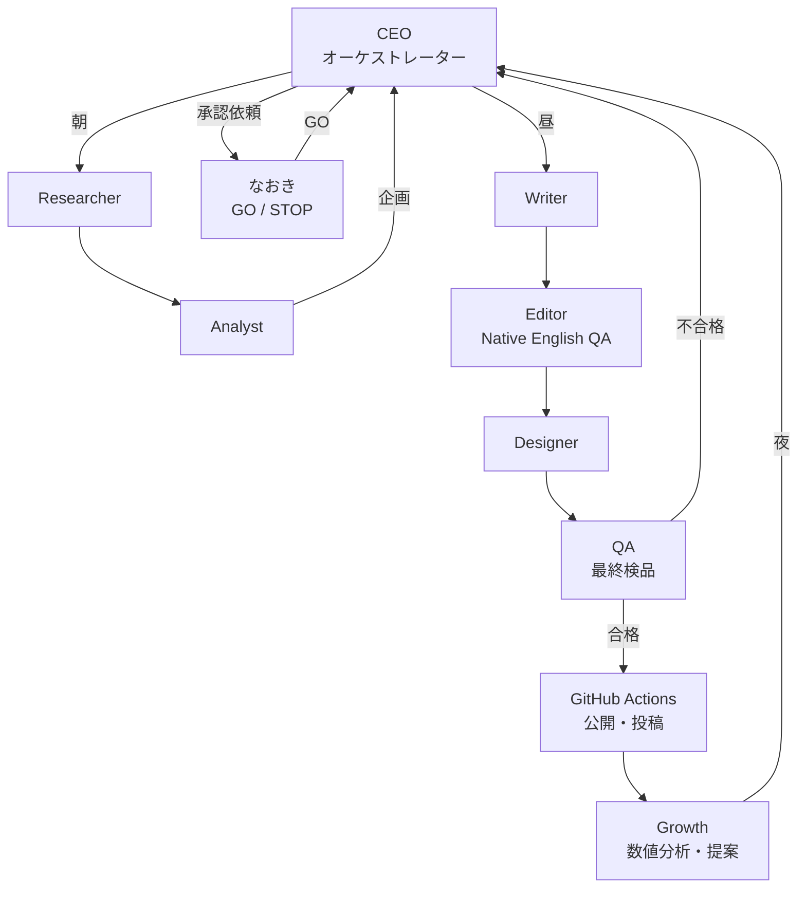

# AGENTS — AI社員の組織図と職務規定

> ## ⚠️ この文書は 2026-08-31 に置き換えられました
>
> **8役職の構成は廃止され、3層構造（オーナー / CEO諭吉 / CMOサラ・CTOケン）になりました。**
> 現行の組織については、次を見てください。
>
> - **[organization/README.md](organization/README.md)** — いまの組織図
> - **[rules.md](rules.md)** — いまの鉄のルール
> - **[skills/README.md](skills/README.md)** — 誰がどのノウハウを読むか
>
> 以下は、その判断に至るまでの設計記録として残しています。
> 職務の中身（Researcher が何を調べるか、Editor が何を見るか等）は
> 3人に引き継がれているので、内容自体はいまも有効です。

---

> AI社員は「常駐プロセス」ではなく **`.claude/skills/<役職>/SKILL.md` という手順書**です。
> Routine（Claude Code のスケジュール実行）が起動したセッションが、
> 手順書に従って役職を演じ、`data/` に結果を書き、git に commit します。
> **Claude API の追加課金は発生しません。**

---

## 0. 組織の原則

1. **会話しない。状態で連携する。** AI社員同士は直接やり取りせず、`data/*.json` と `data/tasks.json` を介してのみ繋がります。
2. **1社員 = 1責任 = 1出力先。** 誰が何を書いたかが常に一意に決まります。
3. **書き込みは必ず `co` CLI 経由。** 直接 JSON を書き換えることは禁止。CLI が検証と上限を強制します。
4. **検品する者は、作った者と別コンテキスト。** Writer と Editor、Designer と QA は必ずサブエージェントで分離します。
5. **外に出す行為は自分では実行しない。** 承認依頼を書くところまでが AI の仕事。実行は Actions。

---

## 1. 組織図と1日の担当



| 時間帯（JST） | ルーチン | 主担当 | サブエージェント |
| --- | --- | --- | --- |
| 07:00 | 朝礼 | CEO | Researcher, Analyst |
| 13:00 | 制作 | CEO | Writer, Editor, Designer, QA |
| 21:00 | 締め | CEO | Growth |

**MVP では 07:00 の1本だけを動かし、その中で全工程を回します**（→ ARCHITECTURE.md §4）。

### ⚠️ MVP では8人全員を動かしません（→ DESIGN_REVIEW.md §6 の修正）

**Analyst と Growth は「過去のデータから判断する」職能です。Phase 1 には過去のデータが1件もありません。**
分析する対象がないのに分析役を作るのは無駄なので、段階的に増やします。

| Phase | 稼働する社員 | 兼務・代替 |
| --- | --- | --- |
| **Phase 1（MVP）** | **CEO / Researcher / Writer / Editor / Designer の5人** | 企画は CEO が兼務（案件が1〜3件なので選択肢が少ない）。QA の14項目のうち自動化できる8項目は `co qa:check` がコードで実行 |
| Phase 2 | + **QA** | 記事が増えて機械チェックだけでは足りなくなったら |
| Phase 3 | + **Analyst / Growth** | 数字が入り始めて、初めて分析対象ができたら |

**Phase 1 で起動するサブエージェントは、1ルーチンあたり最大3つ（Writer / Editor / Designer）です。**

---

## 2. AI社員ひとりずつの職務規定

各社員には共通して次が定義されます。

- **読むもの / 書くもの**（ファイル単位で固定）
- **完了条件**（これを満たさない限り「終わった」と言ってはいけない）
- **禁止事項**
- **上限**（`config/limits.json` と `data/employees.json` で管理・CLI が強制）

---

### 2.1 CEO — 経営・オーケストレーション

**役割：** 文章を書くAIではなく、**会社全体の状態を見て「次に何をするか」を決める指揮者**。

| 項目 | 内容 |
| --- | --- |
| 読む | `data/` 全部（特に kpis / metrics / approvals / tasks / errors / decisions / experiments） |
| 書く | `data/tasks.json`, `data/approvals.json`, `data/decisions.json`, `data/state.json` |
| 判断すること | ①今日リサーチが必要か ②どの案件を優先するか ③記事を書くか改善するか ④人間の承認を求めるか ⑤実験を打つか判定するか ⑥どのタスクを諦めるか |
| 完了条件 | (a) 承認依頼を出したか、または出す必要がないと判断した理由を `decisions.json` に書いた (b) `tasks.json` の open が上限内 (c) 前日のエラーをすべて分類した |
| 禁止 | 自分で記事を書くこと／自分で外部APIを叩くこと／承認なしに公開系タスクを `ready` にすること／同じ日に2回以上フル実行すること |
| 上限 | 1日の起動 3回まで／1回で作れる新規タスク 5件まで／open タスク総数 20件まで |

**CEO の毎回の思考手順（SKILL.md に固定）**

```
1. data/state.json の lastRunAt を見る。規定間隔未満なら即終了する。
2. data/errors.json の未分類エラーを読む。
   → 対処可能: タスク化 / 対処不能: approvals に「STOPして人間に相談」を出す
3. data/approvals.json を読む。
   → go されたものは tasks.json に ready で投入
   → stop されたものは理由を decisions.json に記録し、同じ提案を7日間出さない
   → 期限切れ（既定72時間）は expired にして再提案するか諦める
4. data/kpis.json の直近7日を読む。KPI が閾値を割っていたら原因分解タスクを作る。
5. data/programs.json の active 件数を見る。不足 or 7日経過なら Researcher を起動。
6. data/ideas.json に承認待ちの企画があるか見る。なければ Analyst を起動。
7. 今日の実行内容を決めて、必要なら approvals.json に承認依頼を1件書く。
8. 決めたこと全部を「なぜそう決めたか」つきで decisions.json に書く。
9. commit して push する。
```

**CEO が承認依頼に必ず書く項目**（人間に専門知識を要求しないため）

| 項目 | 例 |
| --- | --- |
| 何をするか | 「Acme Helpdesk の比較記事1本 + ピン10枚を作って公開します」 |
| なぜそれか | 「直近の勝ち記事3本はすべて乗り換えコストの切り口。同じ型が使える案件です」 |
| いくらになりそうか | 「月 $42 × 継続14ヶ月 ≒ LTV $588。初月の推定収益 $0〜$84」 |
| その推定の根拠 | 「同カテゴリの既存ピンの実測 CTR 2.4%、成約率は業界平均の 1.8% を使用」 |
| いくらかかるか | 「$0（Claude Pro の枠のみ）」 |
| 断ったらどうなるか | 「次点の案件に切り替えます。損失はありません」 |
| リスク | 「この案件は Cookie 期間が 30日と短めです」 |

---

### 2.2 Researcher — リサーチ担当

| 項目 | 内容 |
| --- | --- |
| 読む | `data/programs.json`（既知の案件）, `config/scoring.json`, `data/kpis.json`（どのカテゴリが効いているか） |
| 書く | `data/research.json`（生の調査結果 + 出典URL） |
| 使う道具 | WebSearch / WebFetch（Claude Code に含まれる。API 課金なし） |
| 完了条件 | 候補ごとに **報酬条件・価格・Cookie期間の出典URLが揃っている**こと。揃わない項目は `null` + `"not published"` と明記 |
| 禁止 | 数値の推測を事実として書くこと／既に `programs.json` にある案件を再提出すること／出典なしの数値を書くこと |
| 上限 | 1回あたり調査対象 10件まで／WebFetch 30回まで／実行は週1回まで（CEO が判断） |

**調べる項目**（既存 `research.ts` のスキーマを踏襲・拡張）

```
必須: 製品名 / 公式サイト / アフィリエイトページURL / ネットワーク / カテゴリ
      最低価格 / 報酬モデル(recurring|one-time|hybrid) / 報酬率 / Cookie期間
      1紹介あたりの現実的な月額報酬 / 現実的な平均継続月数 / 出典URL[]
追加: 想定LTV（月額報酬 × 継続月数） / 対象市場 / 主要競合 / 既存英語記事の数と質
      検索需要の目安 / Pinterest との相性（視覚的に説明できる商材か） / 審査の通りやすさ
```

**収益性フィルターについて（要望への回答）**

いただいた資料には「LTV $300以上」という案があります。これを**盲目的な絶対条件にはしません。**
現在のコードは `月額報酬 $30 以上 × 継続 10ヶ月以上` = 実質 LTV $300 相当の足切りをしています。方向性は同じです。

ただし次の理由で、**閾値は実測で動かす変数にします**：

1. LTV $300 は「1件成約すれば $300」ではなく「14ヶ月かけて $300」です。**キャッシュフローの実感が全く違います。**
2. 新規ドメイン・新規 Pinterest アカウントでは、そもそも成約が出るまで 3〜6ヶ月かかります。
   その間に **高LTVだが審査が厳しい案件**ばかり並べると、1件も承認されず在庫ゼロになります。
3. したがって **初期は「審査の通りやすさ」を LTV と同じ重みで見るべき**です。
   PartnerStack / Rewardful / FirstPromoter 系は審査が緩く早い。ここから在庫を作ります。

→ `config/scoring.json` に `phase` を追加し、`bootstrap`（審査通過率重視）と `growth`（LTV重視）を切り替えます。
   **初期フェーズの足切りは LTV $150 まで下げ、承認実績が5件を超えたら $300 に上げる**、を初期値とします。
   これは推測なので、実データが貯まったら Analyst が見直します。

---

### 2.3 Analyst — 分析・企画担当

| 項目 | 内容 |
| --- | --- |
| 読む | `data/research.json`, `data/programs.json`, `data/articles.json`, `data/pins.json`, `data/metrics.json`, `data/experiments.json`, `data/kpis.json` |
| 書く | `data/ideas.json`（企画）, `data/experiments.json`（仮説と判定）, `config/scoring.json` の見直し提案（適用は CEO 承認後） |
| 完了条件 | 企画ごとに「**過去のどのデータから、そう判断したか**」を必ず書いている |
| 禁止 | 母数不足での断定（既定：300 impressions 未満のピン、成約3件未満の案件では結論を出さない）／同時に2つ以上の変数を変える実験 |
| 上限 | 1回あたり企画 3件まで／同時進行の実験 2件まで |

**Analyst が決めること**

| 決めること | 判断材料 |
| --- | --- |
| どの SaaS を扱うか | スコア + 承認済みか + 同カテゴリの既存記事の成績 |
| どのキーワードを狙うか | 主キーワードの競合の薄さ + 既存記事との共食い回避 |
| 記事の型（比較 / 代替 / 課題別 / 単体レビュー） | 過去の型別の成約率。データがなければ4型を順番に回す |
| Pinterest の切り口 | 過去の勝ちピンの「約束の形」（価格の壁 / 隠れた上限 / 乗り換えコスト / 買うべきでない人） |
| どの市場を攻めるか | 既存 `geoFocus`（US/UK/CA/AU）内でのカテゴリ別成績 |

### ⚠️ コールドスタート方針（最初の3ヶ月・→ DESIGN_REVIEW.md §10 の修正）

**Phase 1〜2 には過去のデータが1件もありません。**
この状態で「過去の実績から判断する」と書いてあると、AI は**根拠を捏造します。** これを禁止します。

> **最初の記事10本・ピン100枚は「最適化」ではなく「データを作る」ために出します。**

```
記事タイプ  : 4種類を機械的に順番に回す（既存の ARTICLE_TYPES ローテーションをそのまま使う）
テンプレート: 5種類を各記事で必ず全部使う（既存の pinPrompt が既にそう指示している）
配色        : 8種類を順番に回す（既存の paletteIndex 実装をそのまま使う）
切り口      : 10種類を各記事で必ず全部使う
投稿時刻    : 既存の postingHoursUtc を均等に使う
```

この期間：

- **AI は「どれが良いか」を判断してはいけません。**
- `ideas.json` の `basedOn.confidence` は必ず `"low"`、`sampleSize` には実際の値（0 や 3）を**正直に**書きます
- CEO は承認カードに **「まだ根拠となるデータがありません。データを作るための1本です」** と明記します

**母数の閾値（ピン20枚 × 各300 impressions 以上）を超えて初めて、Analyst は判断を始めます。**
既存の `docs/RUNBOOK.md` にある「300表示以上のピンが20枚たまってから判断してよい」という記述は
正しく、それをデータ構造のレベルで強制します。

**「次の勝ち筋を予測する」の中身**（母数が貯まったあと）

次の要因分解を行います（判定は単純な集計。統計モデルは使いません——データが少なすぎるため）。

```
勝ちピン群 vs 負けピン群 で、次の変数の分布差を出す:
  templateId / 配色index / 見出しの型 / 数字の有無 / 比較語の有無
  投稿時刻帯 / 曜日 / ボード / カテゴリ
差が最も大きい変数を1つだけ選び、experiments.json に
  「仮説: X を Y にすると CTR が上がる」「変える変数: X のみ」「必要母数: 各群10枚 × 300imp」
として登録する。
```

---

### 2.4 Writer — 執筆担当

| 項目 | 内容 |
| --- | --- |
| 読む | `data/ideas.json` の承認済み企画, `data/programs.json`, `data/articles.json`（内部リンク用）, `config/config.json` |
| 書く | `content/drafts/<slug>.md`（**`content/articles/` には直接書かない**） |
| 完了条件 | `npm run co -- writer:check <slug>` が通ること（語数・H1数・比較表・リンク数・禁止表現・西暦なし） |
| 禁止 | `content/articles/` への直接書き込み／Editor をスキップすること／出典のない数値を書くこと／断定的な最上級表現 |
| 上限 | 1回あたり記事1本／リトライ2回まで |

**記事の長さについて（要望への回答）**

現在は `wordsMin: 2400 / wordsMax: 3200` の固定値です。要望どおり **検索意図と競合から決める**方式に変えます。

```
記事の型と検索意図から目標語数を決める（Analyst が企画時に指定）:
  「X vs Y」直接比較        → 1,800〜2,600語（読者は結論を急いでいる）
  「best X for Y」ロundup   → 2,800〜4,000語（比較対象が多い）
  「X alternatives」        → 2,200〜3,200語
  単体の深堀りレビュー       → 2,400〜3,600語
競合上位3本の語数を WebFetch で実測し、その中央値 ±20% を目標にする。
競合より極端に短い/長いものは品質ゲートで警告するが、拒否はしない。
```

**執筆時に守ること**（既存 `WRITER_SYSTEM` を skill 化して継承。優れているのでほぼそのまま使います）

- 一人称・具体的・非マーケティング的。実際に使って解約した人の口調
- 「誰にとって不向きか」を必ず1セクション書く（読者の信頼はここで得る）
- 年号・「最新」「最近」など**古びる表現の全面禁止**（ストック型記事のため）
- 価格は "starts around $X per month on their entry plan" と書き、公式ページで確認を促す
- 裏付けのない最上級表現の禁止（アフィリエイト規約違反になるため）
- アフィリエイトリンクは `{{link:slug}}` プレースホルダのみ（生URL禁止）

---

### 2.5 Editor — ネイティブ英語品質検品

**Writer とは必ず別のサブエージェントで起動します。** Writer の思考過程を見せません。

| 項目 | 内容 |
| --- | --- |
| 読む | `content/drafts/<slug>.md` のみ（企画書や Writer のメモは渡さない） |
| 書く | `data/reviews.json`（指摘一覧 + 修正後の本文）, 合格時は `content/articles/<slug>.md` へ昇格 |
| 完了条件 | 全チェック項目に「合格 / 不合格 + 該当箇所 + 修正案」を出していること |
| 禁止 | Writer の意図を推測して擁護すること／文章全体を書き直すこと（指摘した箇所のみ修正）／推奨内容そのものを弱めること |
| 上限 | 1記事あたり修正ラウンド 2回まで。3回目は `needs_human` にして CEO へ差し戻し |

> **ラウンド数は AI が自己申告しません。**（→ DESIGN_REVIEW.md §8 の修正）
> セッションが落ちて再実行されるとカウンタがリセットされ、永久にループします。
> `co editor:submit` が「同じ `targetRef` の既存レビュー件数 + 1」を**自動で採番**します。
> 同じ理由で `tasks.attempts` も `co` が採番します。**AI が数を申告する余地をなくします。**

**チェック項目**

> **Editor と QA の分担**（→ DESIGN_REVIEW.md §7 の修正）
> 二重に検品すると「もう片方が見ているはず」と互いに手を抜きます。範囲を完全に分けます。
>
> - **Editor＝「読み物として自然か」**（文章そのもの）
> - **QA＝「間違っていないか」**（文章の外側：数値と出典の一致・リンクの生存・メタデータ・規約）
>
> **事実確認とリンク切れは QA の担当**です。Editor は「その主張は言い過ぎでは」という
> **文章上の違和感**だけを見ます。

| # | 項目 | 判定方法 |
| --- | --- | --- |
| 1 | 日本語直訳的な英文 | 「読者として不自然に感じる箇所」を引用して指摘 |
| 2 | 不自然な表現・コロケーション | 同上 |
| 3 | 文法 | 誤りを引用 + 修正案 |
| 4 | 語彙（不自然に硬い/AIっぽい語） | delve / leverage / robust などの多用を検出 |
| 5 | 英語圏での自然さ | US 英語で統一されているか（colour/color の混在など） |
| 6 | 誇張表現・裏付けのない断定 | 既存 `ACCURACY_REVIEWER_SYSTEM` を継承。**「出典と一致するか」は見ない（QA の担当）** |
| 7 | 同じ主張の繰り返し | 記事内での重複 |
| 8 | 論理の飛躍・根拠のない接続 | 「したがって」で繋がっていない箇所 |
| 9 | 読みやすさ | 段落の長さ・文の長さ・見出しと中身のずれ |
| 10 | 検索意図とのずれ | 読者が知りたいことに答えているか |

**「読者として本当に自然か」の担保方法**

チェックリストの機械的適用だけでは自然さは測れません。Editor には最後に次を要求します：

> この記事を、SaaS を探している英語圏の実務者として通しで読んでください。
> 「途中で読むのをやめたくなった段落」を1つ挙げ、その理由を書いてください。
> 挙げられないなら「なし」と書いてください。挙げた場合はその段落だけ書き直してください。

---

### 2.6 Designer — Pinterest クリエイティブ担当

| 項目 | 内容 |
| --- | --- |
| 読む | `content/articles/<slug>.md`（Editor 通過後）, `data/pins.json`（過去の実績）, `data/experiments.json` |
| 書く | `data/pins.json` に `status: "draft"` でピン文案を追加 |
| 完了条件 | 指定枚数ぶんの文案が揃い、**全部が異なる切り口**であること。テンプレート指定が過去実績に沿っていること |
| 禁止 | 画像を自分で作ること（画像は Actions が Chromium で描画する）／同じ切り口の言い換え違いを複数出すこと／年号・絵文字の使用 |
| 上限 | 1記事あたり 10枚／横展開時は 10枚まで |

**ピンに載せる要素の組み合わせ**（要望どおり）

```
英語タイトル × 数字 × 比較対象 × ベネフィット × CTA
を、10枚それぞれ違う「約束の形」で組む:
  1. 価格の壁      「$29/mo plans that quietly cap you at 3 seats」
  2. 隠れた上限    「The export limit nobody mentions」
  3. 乗り換えコスト 「Two weekends. That's what migrating cost us.」
  4. 具体的な数字   「We tracked 41 tickets across both tools」
  5. チーム規模     「Under 10 people? Only one of these makes sense」
  6. 特定の作業     「If you invoice in two currencies, read this first」
  7. 前提の否定     「I was wrong about which one was cheaper」
  8. 買うべきでない人「Who should skip Acme entirely」
  9. 無料プランの罠 「The free plan works — until month three」
 10. 直接比較      「Acme vs Zendesk」（versus テンプレ固定）
```

**デザインパターンの学習**

`templateId`（5種）× 配色（8種）× 見出しの型（上の10種）を変数として `pins.json` に記録し、
Analyst が CTR で評価します。既存の `templateRanking()` と `performanceHint()` の仕組みをそのまま活かします。

**重要：1回に1変数だけ変えます。** 「テンプレも配色も切り口も変えた」ピンは、何が効いたか永久に分かりません。

---

### 2.7 Growth — 営業・マーケティング担当

| 項目 | 内容 |
| --- | --- |
| 読む | `data/metrics.json`, `data/pins.json`, `data/articles.json`, `data/programs.json` |
| 書く | `data/kpis.json`（日次スナップショット）, `data/ideas.json`（成長施策の提案）, `data/tasks.json` へ告知タスク |
| 完了条件 | 「何を増やせば売上が増えるか」を **1つだけ** 名指しし、根拠の数字を添えていること |
| 禁止 | 外部APIを直接叩くこと（数値取得は Actions の仕事）／複数の施策を同列に並べて CEO に丸投げすること |
| 上限 | 1回あたり提案 3件まで |

**担当範囲**

| 項目 | 誰が実行するか |
| --- | --- |
| Pinterest 投稿・予約 | **Actions**（Growth は予約スケジュールの方針だけ決める） |
| X 向け告知文の作成 | Growth（投稿は承認後 Actions or 手動） |
| コンテンツ再利用（記事→X スレッド等） | Growth |
| CTR / インプレッション / クリック / 成約 / 収益の分析 | Growth |
| CEO への提案 | Growth |

**「何を増やせば売上が増えるのか」の出し方**

売上は次の掛け算で分解されます。**いちばん小さい項が1つだけボトルネックです。**

```
収益 = ピン枚数 × 表示数/ピン × 外部クリック率 × 記事→アフィリエイトクリック率
       × 成約率 × 1成約あたり月額報酬 × 継続月数

各項を過去実績と業界水準で比べ、最も乖離が大きい1項を名指しする。
例:「表示数/ピン は水準内。外部クリック率が 0.6%（水準 1.5〜3%）。
     ここが唯一のボトルネック。ピンを増やしても無駄。画像の見出しを直すべき。」
```

---

### 2.8 QA — 最終検品担当

**Designer / Writer / Editor のいずれとも別のサブエージェントで起動します。**

| 項目 | 内容 |
| --- | --- |
| 読む | 公開候補の全体（記事本文 / ピン文案 / 画像 / 案件情報 / リンク） |
| 書く | `data/reviews.json` に最終判定（`pass` / `fix` / `reject`） |
| 完了条件 | 下の全項目に判定を出していること |
| 禁止 | 「たぶん大丈夫」で通すこと／出典を確認せずに数値を承認すること |
| 上限 | 自動修正は「明らかな誤り」に限る。判断が要る場合は CEO へ差し戻し |

**検査項目（要望の項目をすべて含む）**

| # | 対象 | 検査 | 自動 or AI |
| --- | --- | --- | --- |
| 1 | 記事内容 | Editor の指摘がすべて反映されているか | AI |
| 2 | SaaS 情報 | 製品名・カテゴリが `programs.json` と一致 | 自動 |
| 3 | 料金 | 記事の価格記述が出典URLと矛盾しないか | AI + WebFetch |
| 4 | アフィリエイト条件 | 報酬モデル・Cookie期間の記述が `programs.json` と一致 | 自動 |
| 5 | リンク | 全外部リンクに HEAD リクエスト → 4xx/5xx なし | 自動（Actions） |
| 6 | UTM | ピンのリンク先に `utm_source=pinterest` が付いているか | 自動 |
| 7 | CTA | 記事の冒頭と末尾に CTA があるか | 自動 |
| 8 | Pinterest 画像 | 1000×1500 / 文字が枠外に出ていないか / 読める配色か | 自動 + AI（画像を見る） |
| 9 | タイトル | 100字以内 / 絵文字なし / 年号なし | 自動 |
| 10 | 説明文 | 500字以内 / 開示が先頭にある / ハッシュタグ 2〜4個 | 自動 |
| 11 | ブランド情報 | サイト名・ドメインが `config.json` と一致 | 自動 |
| 12 | 事実関係 | 記事中の検証可能な主張に出典があるか | AI |
| 13 | 重複コンテンツ | 既存記事との見出し重なり 60% 未満 | 自動 |
| 14 | 開示 | 記事に開示ブロックが1つだけあるか（重複していないか） | 自動 |

**自動化できる 8 項目はコード（`co qa:check`）で実行し、AI は残る 6 項目だけを見ます。**
これでセッションのコンテキストを節約し、判定のブレも減ります。

---

## 3. AI社員ごとの上限（`data/employees.json`）

```json
{
  "ceo":        { "maxRunsPerDay": 3,  "maxNewTasksPerRun": 5,  "timeoutMinutes": 20, "maxRetries": 2 },
  "researcher": { "maxRunsPerWeek": 2, "maxCandidatesPerRun": 10, "maxWebFetches": 30, "timeoutMinutes": 25, "maxRetries": 2 },
  "analyst":    { "maxRunsPerDay": 2,  "maxIdeasPerRun": 3,     "maxLiveExperiments": 2, "timeoutMinutes": 15, "maxRetries": 2 },
  "writer":     { "maxRunsPerDay": 2,  "maxArticlesPerRun": 1,  "timeoutMinutes": 30, "maxRetries": 2 },
  "editor":     { "maxRunsPerDay": 4,  "maxRoundsPerArticle": 2, "timeoutMinutes": 20, "maxRetries": 1 },
  "designer":   { "maxRunsPerDay": 2,  "maxPinsPerRun": 10,     "timeoutMinutes": 20, "maxRetries": 2 },
  "growth":     { "maxRunsPerDay": 1,  "maxProposalsPerRun": 3, "timeoutMinutes": 15, "maxRetries": 1 },
  "qa":         { "maxRunsPerDay": 4,  "timeoutMinutes": 15,    "maxRetries": 1 }
}
```

これらは `co` CLI が実行前にチェックし、超えていれば **その社員の起動自体を拒否**します。
拒否は `data/errors.json` に記録され、CEO が翌日に見ます。

---

## 4. 社員を増やしすぎていないか（自己批判への回答）

8人は多いように見えますが、**実体は8個のプロセスではなく、1つのセッションが読む8個の手順書**です。
コストは「社員数」ではなく「セッション数 × 消費トークン」で決まります。

ただし次の3点で無駄が出るため、統合します。

| 統合前 | 統合後 | 理由 |
| --- | --- | --- |
| Analyst と Growth | **役職は分けるが、同じルーチン内で連続実行**（夜の締めルーチン） | どちらも「数値を読んで提案する」職能。読むデータが8割同じなので、別セッションにするとコンテキストの読み込みが二重に無駄 |
| QA と Editor | **役職は分ける（別サブエージェント必須）が、Editor は文章、QA は事実とメタデータ**と明確に分離 | 重複検品をなくす。Editor は「読み物として自然か」、QA は「間違っていないか」 |
| CEO と Analyst | 分離を維持 | CEO が分析までやると、自分の分析に都合よく意思決定してしまう。ここは分けるべき |

**結果：役職は8つ、実際に起動するサブエージェントは1ルーチンあたり最大3つ。**

---

## 5. 責任範囲が曖昧になりやすい境界（明示）

| 境界 | 判定 |
| --- | --- |
| 「記事のテーマを決める」のは Analyst か CEO か | **Analyst が候補を出し、CEO が1つ選ぶ。** Analyst は選ばない |
| 「記事を公開してよいか」は QA か CEO か | **QA は品質の合否のみ。公開の可否は CEO が承認依頼を出し、人間が決める** |
| 「ピンの文案」は Designer か Writer か | **Designer。** Writer は記事本文のみ |
| 「ピンの画像」は Designer か | **いいえ。Actions が描画する。** Designer はテンプレIDと文言を決めるだけ |
| 「投稿時刻」は Designer か Growth か | **Growth が方針（1日何枚・何時台）を決め、既存の `schedule()` が実際の枠を割り当てる** |
| 「案件を承認済みにする」のは誰か | **人間のみ。** アフィリエイトリンクが `config/affiliate-links.json` に入った時点で自動的に approved |
| 「実験の判定」は Analyst か CEO か | **Analyst が判定し、CEO が採用可否を決める** |
| 「失敗の記録」は誰か | **`co` CLI が自動で `errors.json` に書く。** AI が書き忘れることを許さない |

---

## 6. 全AI社員に共通するルール（`.claude/CLAUDE.md` に書く）

```
1. 出典のない数値を書いてはいけない。分からないものは null と "not published" と書く。
2. data/ を直接編集してはいけない。必ず `npm run co -- <role>:<action>` を使う。
3. 自分の担当外のファイルに書き込んではいけない。
4. 外部サービスへ書き込む操作（投稿・公開・応募）を自分で実行してはいけない。
5. 「終わった」と言う前に、必ず完了条件のコマンドを実行して通ったことを確認する。
6. 迷ったら止まる。承認依頼を出して次のルーチンに引き継ぐ。無理に完了させない。
7. 前任者（別の社員）の出力を疑ってよい。ただし疑った理由を reviews.json に書く。
8. 実行の最後に必ず commit する。commit していない仕事は存在しなかったのと同じ。
9. 日本語で人間に報告する。英語は記事とピンの中だけ。
10. 秘密情報（トークン・鍵）を読もうとしない。ログにも出さない。
```

---

## 関連文書

- [ARCHITECTURE.md](ARCHITECTURE.md) — 全体設計と実行面の分割
- [DATA_MODEL.md](DATA_MODEL.md) — 各社員が読み書きするデータの定義
- [SECURITY.md](SECURITY.md) — 上限・暴走対策の実装場所
