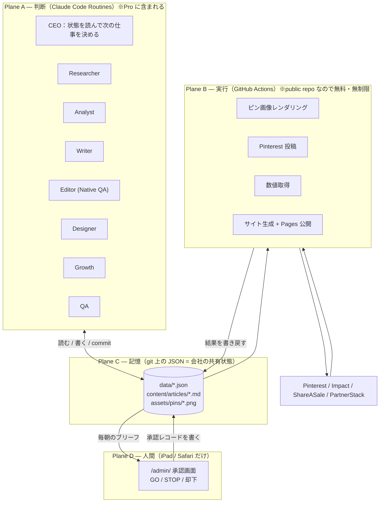
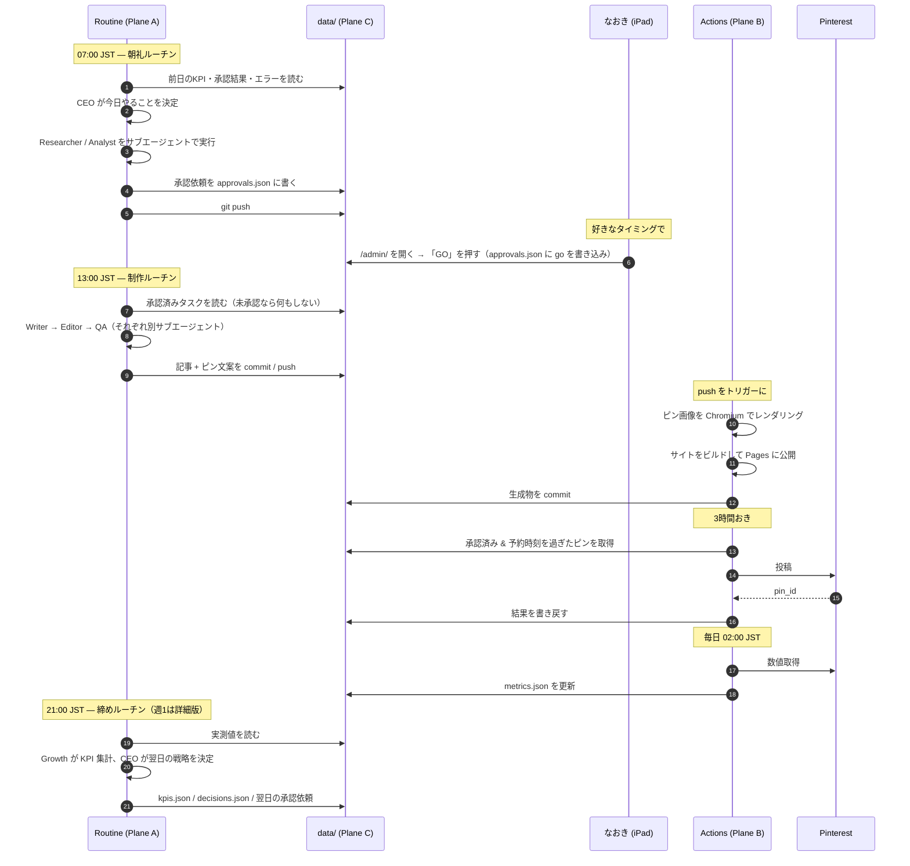
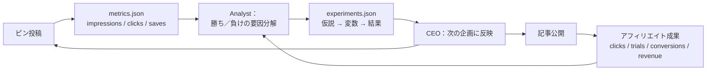

# ARCHITECTURE — AI会社としての全体設計

> この文書は「いまのシステムが何であるか」を先に確定させ、そのうえで
> 「AI社員が自律運営する会社」へどう作り変えるかを定義します。
> 実装はまだ始めていません。まずここを読んで OK / 修正指示をください。

---

## 0. 結論の要約（これだけ読めば分かる版）

| 問い | 答え |
| --- | --- |
| いまの仕組みは何か | GitHub Actions が Node の CLI を叩き、その CLI が **Claude API に課金しながら**記事・ピン・リサーチを生成している |
| いま実際に動いているか | 動いている。ただし **`ANTHROPIC_API_KEY` が未設定なので DRY_RUN（サンプル文）で動いている**。毎日サンプル記事が本番サイトに公開されている（→ §1.6・要緊急対応） |
| Claude API をやめられるか | **やめられる。** 判断・執筆・検品・分析は Claude Code の **Routines（Pro に含まれる／追加課金なし）**へ移せる |
| やめられない部分は | **ない。** ただし「Pro の利用枠を消費する」という別のコストに変わる（→ COSTS.md §4） |
| 既存コードは捨てるか | **捨てない。** 5,800行のうち約 80% はそのまま再利用する。捨てるのは「Claude API を呼ぶ配線」だけ |
| 人間がやることは | GO / STOP / 承認 / 却下 / 換金判断。iPad の Safari だけで完結 |

---

## 1. 現状のシステム（調査結果）

### 1.1 全体構成

```
GitHub Actions (cron)
   └→ npx tsx src/cli.ts <command>
         ├→ src/lib/claude.ts ──→ Anthropic API（課金）
         ├→ src/integrations/pinterest.ts ──→ Pinterest API v5
         ├→ src/integrations/affiliates.ts ──→ Impact / ShareASale / PartnerStack
         ├→ src/pins/render.ts ──→ Playwright + Chromium（ローカル描画・$0）
         └→ data/*.json（＝データベース）／content/articles/*.md
   └→ 生成物を git commit して push
   └→ public/ を GitHub Pages にデプロイ
```

コード量は 5,801 行（TypeScript）。設計・実装の質は高く、**作り直す必要はありません。**

### 1.2 実装済みの機能（stage 単位）

| ファイル | 役割 | Claude API を使うか |
| --- | --- | --- |
| `src/stages/research.ts` | 継続報酬型 SaaS 案件のリサーチ + 足切り + スコアリング | **使う**（Web検索 + 構造化出力の2回） |
| `src/stages/content.ts` | 記事の設計 → 執筆 → 誇張レビュー → 品質ゲート → 自動修正 | **使う**（最大4回／記事） |
| `src/stages/pins.ts` | ピン10枚の文案生成 + 予約スケジューリング | **使う**（1回） |
| `src/stages/humantasks.ts` | 人間タスクの洗い出し + 応募文の下書き | **使う**（案件ごと1回） |
| `src/stages/report.ts` | REPORT.md 生成 + マイルストーン到達時の発信素材 | **一部使う** |
| `src/stages/publish.ts` | 予約時刻を過ぎたピンを Pinterest へ投稿 | 使わない |
| `src/stages/analytics.ts` | Pinterest / アフィリエイトの数値取得 | 使わない |
| `src/stages/optimize.ts` | CTR 3% 以上を勝ち型と判定し別記事へ横展開 | 使わない（横展開の文案生成で pins.ts 経由で使う） |
| `src/stages/export.ts` | 手動投稿用の CSV + 画像書き出し | 使わない |
| `src/stages/doctor.ts` | 環境チェック | 疎通確認のみ（無料） |
| `src/stages/provider.ts` | 接続先APIの機能実測 | 使う（テスト時のみ） |
| `src/site/build.ts` | 静的サイト生成（SEO / JSON-LD / sitemap / `/go/` 中継） | 使わない |
| `src/pins/render.ts` `templates.ts` | 5テンプレ × 8配色でピン画像を Chromium 描画 | **使わない（$0）** |
| `src/admin/page.ts` | GitHub Pages 上の静的管理画面（PATでGitHub API直叩き） | 使わない |
| `src/admin/pinterestConnect.ts` | ターミナル不要の Pinterest OAuth 導線 | 使わない |

### 1.3 GitHub Actions ワークフロー（6本）

| ワークフロー | トリガー | 内容 | Claude API |
| --- | --- | --- | --- |
| `autopilot-daily.yml` | 毎日 03:00 UTC（12:00 JST） | `daily`：リサーチ→記事1本→ピン10枚→投稿→サイト再生成→Pages公開 | **使う** |
| `autopilot-pins.yml` | 3時間おき | `pins:publish`：予約分を Pinterest へ投稿 | 使わない |
| `autopilot-weekly.yml` | 毎週月 04:00 UTC | `weekly`：数値取得→勝ち型検出→横展開→レポート | **使う** |
| `ci.yml` | push / PR | typecheck + DRY_RUN でパイプライン全通し | 使わない |
| `pinterest-token-exchange.yml` | 手動 | 認可コード→refresh_token→Secrets 書き込み | 使わない |
| `rebuild-site.yml` | 手動 | サイトだけ再ビルド・再公開 | 使わない |

補助 action：`.github/actions/setup`（Node + npm ci + Chromium）、`.github/actions/commit`（生成物を commit して push、リトライ付き）。

**このリポジトリは public です。したがって GitHub Actions の実行時間は無制限・無料です。** これは設計上とても大きい前提です。

### 1.4 データベース（＝ git 上の JSON）

| ファイル | 実体 | 現在の中身 |
| --- | --- | --- |
| `data/programs.json` | アフィリエイト案件 | 3件（すべて `Sample ...` のダミー） |
| `data/articles.json` | 記事メタ | 2件（すべてダミー） |
| `data/pins.json` | ピン | 20枚（予約14 / 失敗6） |
| `data/metrics.json` | 実測値 | 未生成 |
| `data/human-tasks.json` | 人間タスク | 9件すべて未完了 |
| `data/state.json` | パイプラインの進行状態 | あり |
| `data/runlog.json` | 実行ログ | 2件 |
| `config/config.json` | 事業設定（ニッチ / 語数 / ピン枚数 / モデル割当 …） | あり |
| `config/scoring.json` | 案件スコアリングの重みと足切り | あり |
| `config/affiliate-links.json` | 承認済みアフィリエイトリンク | **空**（＝収益ゼロ） |

「DB は git 上の JSON」という選択は、この規模では正しい判断です。無料・差分が見える・iPad から読める・バックアップ不要。**この方式は新設計でも維持します。**

### 1.5 外部 API と認証情報

| サービス | 用途 | Secrets | 現在の状態 |
| --- | --- | --- | --- |
| Anthropic API | 記事・リサーチ・ピン文案 | `ANTHROPIC_API_KEY` | **未設定**（→ DRY_RUN で動作） |
| Pinterest API v5 | ボード作成 / ピン投稿 / 数値取得 | `PINTEREST_APP_ID` / `_APP_SECRET` / `_REFRESH_TOKEN` | 設定済みらしいが **Trial access のまま** |
| Impact | 成果取得 | `IMPACT_ACCOUNT_SID` / `_AUTH_TOKEN` | 未設定 |
| ShareASale | 成果取得 | 3種 | 未設定 |
| PartnerStack | 成果取得 | 2種 | 未設定 |
| GitHub | Secrets 書き込み（Pinterest連携時のみ） | `GH_PAT_FOR_SECRETS` | 一時利用 |

### 1.6 ⚠ いま起きている3つの問題（設計より先に直すべき）

**問題1：本番サイトにサンプル記事が公開されている（最重要）**

`ANTHROPIC_API_KEY` が未設定のため `env.dryRun` が `true` になり、`withFixture()` がサンプル文を返します。
そのサンプル記事（"Sample Kanbanly vs Competitor A"、本文に "This is placeholder prose generated in DRY_RUN mode" と書かれている）が、
毎日 `autopilot-daily.yml` によって **worked-for-us.com に公開され続けています。**

- Pinterest から見れば「中身のないサイト」→ ドメインの信頼度が落ちる
- Google から見れば「自動生成の薄いコンテンツ」→ インデックスされない／評価が下がる
- アフィリエイト審査で見られたら **確実に落ちます**

対策：`env.dryRun === true` のとき **サイト公開と commit を行わない**（生成はしてよいが公開しない）ガードを入れる。
これは 5 行程度の変更です。設計完了を待たずに入れるべきだと考えます（→ MIGRATION.md Phase 0）。

**問題2：Pinterest が Trial access のまま**

失敗した 6 枚のピンのエラー：

```
403 {"code":29,"message":"Apps with Trial access may not create Pins in production
https://api.pinterest.com - use API Sandbox https://api-sandbox.pinterest.com instead."}
```

Trial access で作ったピンは **作成者にしか見えない Sandbox ピン**です。集客源になりません。
Standard access の審査（OAuth フローの画面録画の提出が必要）を通すまで、Pinterest 経由の流入はゼロです。
→ 逃げ道として `pins:export`（CSV + 画像書き出し → 手動 / 外部予約ツール）が既に実装されています。これは維持します。

**問題3：アフィリエイトリンクが1本も登録されていない**

`config/affiliate-links.json` の `links` が空。したがって全記事の `{{link:...}}` は
`/go/<slug>/` 経由で **公式サイトへの素のリンク**に落ちています。**現時点で収益は構造的にゼロです。**

> つまり現状は「エンジンは完成していて回っているが、燃料（本物のリンク・本物の記事・本物の投稿経路）が
> 1つも入っていない」状態です。AI会社化の前に、この3つを埋めることが最短の収益化です。

---

## 2. 新アーキテクチャ — 4つの実行面（execution plane）

いちばん大事な設計判断は「**何をどこで動かすか**」です。役割ではなく **性質**で分けます。



### 各 Plane の役割と制約

| Plane | 何が動くか | 費用 | できること | できないこと |
| --- | --- | --- | --- | --- |
| **A：判断** | Claude Code の cloud session（Routines が起動） | **Pro に含まれる**（追加課金なし。ただし Pro の利用枠を消費） | Web検索 / ページ取得 / ファイル編集 / bash / git push / サブエージェント | ①1時間より細かい周期で動かせない ②長期の秘密情報を安全に持てない（環境変数は環境利用者から見える） ③1日の実行回数に上限あり |
| **B：実行** | GitHub Actions | **無料・無制限**（public repo） | Secrets を安全に保持 / 外部APIを叩く / Chromium 描画 / Pages 公開 / 分単位の cron | 判断・文章生成は一切できない |
| **C：記憶** | git 上の JSON + Markdown + PNG | **無料** | 全履歴が残る / 差分が見える / どこからでも読める | 同時書き込みに弱い（→ `concurrency` で直列化） |
| **D：人間** | GitHub Pages 上の静的ページ | **無料** | GO / STOP / 却下 / リンク登録 | 技術的な判断は要求しない |

### Plane A は `main` に直接 push しない（→ DESIGN_REVIEW.md §2 の修正）

Claude Code の cloud session は `claude/` 接頭辞のブランチには常に push できますが、
それ以外のブランチは保護状態などをチェックされます。この性質を安全装置として使います。

```
Routine → claude/autopilot-<日付> に push
            ↓
        guard.yml が検査（承認漏れ / 上限違反 / スキーマ違反 / limits.json や .github/ の改変）
            ↓ 合格
        main へ自動マージ → mechanical-build.yml が公開処理を行う
            ↓ 不合格
        マージしない。errors.json に記録して /admin/ に警告を出す
```

**AI の失敗が本番データを直接壊すことはありません。**
Phase 1 は自動マージ、必要になれば Phase 2 以降で PR レビュー方式に切り替えられます。

### この分割がもたらすもの

1. **Claude API 課金が消える。** 判断はすべて Plane A（Pro のサブスクに含まれる）で行う。
2. **秘密情報が AI に触れない。** Pinterest やアフィリエイトのトークンは Plane B（Actions Secrets）にだけ存在する。
   Plane A のセッションはトークンを見ることができない。漏洩の面積が最小になる。
3. **AI の暴走が外に出ない。** 外部への副作用（投稿・公開）はすべて Plane B が実行する。
   Plane B は「承認レコードがある仕事しか実行しない」ようコードで強制する。
   **AI がどれだけ間違えても、承認なしには1枚も投稿されません。**

---

## 3. AI社員の実装形態 — 「プロンプトを書くAI」ではなく「手順書を持つ職能」

AI社員は **サーバー上で常駐するプロセスではありません。**
`.claude/skills/<役職>/SKILL.md` という **手順書（skill）** として実装します。

```
.claude/
  skills/
    ceo/SKILL.md          … 会社の状態を読み、次の仕事を決め、承認依頼を書く
    researcher/SKILL.md   … SaaS と案件を調べて data/research.json に書く
    analyst/SKILL.md      … 過去実績から次に書くべきテーマを決める
    writer/SKILL.md       … 英語記事を書く
    editor/SKILL.md       … ネイティブ品質で独立検品する
    designer/SKILL.md     … ピンの文案とデザインパターンを決める
    growth/SKILL.md       … 告知素材と成長施策を作る
    qa/SKILL.md           … 公開前の最終検品
  CLAUDE.md               … 全AI社員に共通する会社のルール（禁止事項・上限・口調）
```

### なぜ skill 方式なのか

- **Claude API を1回も呼ばずに、同じ品質の出力が得られる。** 判断しているのは cloud session 自身だから。
- **構造化出力（`output_config.format`）の代わりを、コードで持つ。**
  いまは Anthropic API の構造化出力機能で JSON の形を保証していますが、これは API 固有の機能です。
  代わりに **zod のスキーマを「検証コマンド」として残し**、AI社員が書いた JSON をコマンドで検証させます。

  ```
  AI が data/inbox/research-2026-09-01.json を書く
     → npm run co -- researcher:submit data/inbox/research-2026-09-01.json
     → zod で検証。落ちたらエラーを表示して AI が直す。通ったら data/research.json に取り込む
  ```

  **形の保証は API 機能ではなく、リポジトリ内のコードが担保します。** これが移行の肝です。
- **Writer と Editor を本当に別人格にできる。** サブエージェント（別コンテキスト）で起動すれば、
  Editor は「Writer がどう考えて書いたか」を知らない状態で読めます。いまの `accuracyReview` は
  同じ API 呼び出しの延長で、記事本文だけを渡している点は良いのですが、サブエージェントのほうがより独立します。

### AI社員間の通信 — 会話ではなく「会社の共有状態」

要望どおり、AI 社員は直接会話しません。**全員が `data/` を読み書きし、`data/tasks.json` を介してのみ連携します。**

```
Researcher → data/research.json          （候補SaaSと案件）
Analyst    → data/ideas.json             （記事テーマ案 + 勝ち筋の根拠）
CEO        → data/approvals.json         （人間への承認依頼）＋ data/tasks.json（承認後のタスク）
Writer     → content/drafts/*.md         （下書き）
Editor     → data/reviews.json           （指摘 + 修正後の本文）
QA         → data/reviews.json           （最終検品の合否）
Designer   → data/pins.json (status=draft)（ピン文案 + テンプレ指定）
Actions    → assets/pins/*.png           （画像レンダリング）
Actions    → data/pins.json (published)  （投稿結果）
Actions    → data/metrics.json           （実測値）
Growth     → data/kpis.json              （KPI 集計 + 提案）
CEO        → data/decisions.json         （何をなぜ決めたかの記録）
```

**すべての中間状態が git に残るので、後から「なぜこうなったか」を人間もAIも追跡できます。**
これが自己改善ループの土台になります。

---

## 4. 1日の流れ（自律運営のタイムライン）



### ルーチンは1日何本か（Pro の利用枠との折り合い）

**MVP は 1日1本から始めます。** Routines は Pro の利用枠を消費するため、
最初から1日3本回すと、なおきさん自身が Claude を使う枠を圧迫する可能性があります。

| 段階 | ルーチン本数 | 産出ペース | 判断 |
| --- | --- | --- | --- |
| MVP（最初の2週間） | 1日1本（朝のみ） | 2日に記事1本 | まずここ。利用枠の実測を取る |
| 拡張1 | 1日2本（朝・夕） | 1日1本 | 枠に余裕があれば |
| 拡張2 | 1日3本 + 週次1本 | 1日1〜2本 | Max プランに上げるなら |

**これは設定で変えられる値にします。** ルーチンを増やすかどうかは、実測後になおきさんが決める判断です。

---

## 5. 人間の承認ゲート（要望どおり GO / STOP だけ）

`/admin/` に表示される承認カードの例：

```
┌──────────────────────────────────────────────┐
│ 本日の提案 #2026-09-01-01                     │
│                                              │
│ 案件      : Acme Helpdesk（customer support） │
│ ネットワーク: PartnerStack                     │
│ 想定報酬  : 月 $42 × 継続14ヶ月 ≒ LTV $588     │
│                                              │
│ 実行内容                                      │
│   ・比較記事 1本（Acme vs Zendesk）           │
│   ・Pinterest ピン 10枚                       │
│   ・X 告知 2本                                │
│                                              │
│ 推定 CTR      : 2.4%（過去の同カテゴリ実績）    │
│ 推定 成約率   : 1.8%                          │
│ 推定 初月収益 : $0〜$84                        │
│ 追加コスト    : $0（Claude Pro の枠のみ）       │
│                                              │
│ なぜこれを選んだか                             │
│   直近3本の勝ち記事はすべて「乗り換えコスト」    │
│   を扱っていた。この案件は移行手順が複雑で       │
│   同じ切り口が使える。日本語競合はゼロ。         │
│                                              │
│         [  GO  ]        [  STOP  ]           │
└──────────────────────────────────────────────┘
```

### 承認が必要なもの / 不要なもの

| 行為 | 承認 | 理由 |
| --- | --- | --- |
| 記事を書く・下書きを保存する | 不要 | 外に出ないので取り返しがつく |
| ピンの文案・画像を作る | 不要 | 同上 |
| **サイトに記事を公開する** | **必要** | 外部に出る。ドメインの評価に影響する |
| **Pinterest に投稿する** | **必要** | 外部に出る。アカウント停止リスクがある |
| **X に投稿する** | **必要** | 同上 |
| **アフィリエイトプログラムに応募する** | **必要（人間が実行）** | 本人確認・契約行為。代理できない |
| 案件のスコアを更新する | 不要 | 内部データ |
| 戦略を変更する（カテゴリ追加など） | **必要** | 事業方針の変更 |
| 予算・上限値を変更する | **必要** | 安全装置の変更 |

**この判定は AI の裁量ではなく `config/limits.json` に列挙され、Plane B のコードが強制します。**

### 将来の自動化への移行

「十分な実績で自動実行へ移行できる設計に」という要望に対して、
`config/limits.json` に **信頼レベル**を持たせます。

```json
{
  "autonomy": {
    "publishArticle":  { "level": "approval", "autoAfter": { "consecutiveApprovals": 20, "zeroQaFailures": true } },
    "publishPin":      { "level": "approval", "autoAfter": { "consecutiveApprovals": 50 } },
    "postToX":         { "level": "approval" }
  }
}
```

条件を満たすと CEO が「この行為を自動実行に切り替えてよいか」という**承認依頼**を出します。
**自動化のレベルを上げる判断自体も、人間の GO を必要とします。** AI が勝手に権限を広げることはできません。

---

## 6. 自己改善ループ



いまの `optimize.ts` は「CTR 3% 以上のピンの**構造**を別記事へ横展開する」という良い仕組みを持っています。これは維持します。
そのうえで、**要因を変数に分解して記録する**層を足します。

記録する変数（ピン）：`templateId` / 配色 / 見出しの型（数字・比較・否定・価格） / CTA の有無 / 投稿時刻 / 曜日 / ボード / カテゴリ
記録する変数（記事）：記事タイプ（比較・代替・課題別・単体） / 語数 / 見出し数 / CTA 位置 / 内部リンク数 / 案件のネットワーク

`data/experiments.json` に「1回に1変数だけ変える」実験を記録し、
十分な母数（既定：300 impressions 以上のピンが両群に 10 枚以上）が貯まったら Analyst が判定します。

> **母数が足りないうちは判定しない**、を厳格に守ります。
> Pinterest は投稿から流入が立ち上がるまで 2〜3ヶ月かかるので、
> 最初の2ヶ月は「数字が動かないのが正常」です。ここで設定をいじると学習が壊れます。

---

## 7. 暴走・重複・無限ループの防止

すべての書き込みは `co`（company）CLI を通します。CLI が `config/limits.json` を強制します。

| リスク | 対策 | 実装場所 |
| --- | --- | --- |
| 同じ記事の重複生成 | 「主キーワード + 案件slug」の正規化ハッシュで既存記事と照合。さらに見出し集合の重なりが 60% を超えたら拒否 | `co` CLI |
| 同じピンの大量投稿 | 画像バイトの SHA-256 と `overlayMain` の正規化ハッシュで重複拒否 | `co` CLI |
| 1日の投稿過多 | `pins.publishPerDay` + ランプアップ（既存実装を維持）。加えて Actions 側で「その日すでに投稿した枚数」を実測して上限を超えたら停止 | Actions |
| タスクの無限増殖 | `tasks.json` の open 上限（既定 20）。超えたら CEO は新規タスクを作れず、既存の消化のみ | `co` CLI |
| 同じタスクの重複実行 | タスクに冪等キー（`kind + 対象slug + 日付`）。同じキーが `done` / `running` なら作成拒否 | `co` CLI |
| 無限リトライ | タスクごとに `attempts` と `maxAttempts`（既定 3）。超えたら `parked` にして CEO へエスカレーション | `co` CLI |
| ルーチンの暴走 | Routines は最短でも1時間間隔。加えて `data/state.json` に `lastRunAt` を持ち、規定間隔未満の再実行は即終了 | skill 冒頭 |
| 予算超過 | Claude API を使わないので金銭コストは発生しない。ただし **Pro の利用枠**を予算とみなし、`kpis.json` に日次の routine 実行回数を記録して上限を超えたらルーチンを自動停止 | `co` CLI |
| 誤った SaaS 情報 | 料金・報酬条件は必ず出典 URL を `evidence[]` に持つ。URL のない数値は QA が不合格にする | `qa` skill + `co` CLI |
| 壊れたリンク | 公開前に全外部リンクへ HEAD リクエスト。4xx/5xx があれば公開を止める | Actions |
| 承認なしの公開 | Actions が `approvals.json` を照合し、承認がなければ投稿・公開処理を skip | Actions |

**最後の行がいちばん重要です。安全装置は AI の中ではなく、AI が触れないコード（Actions）に置きます。**

---

## 8. 「Claude API が要るもの／要らないもの」の切り分け

| 処理 | Claude API が必要か | 代替 |
| --- | --- | --- |
| 案件リサーチ（Web検索して調べる） | **不要** | Routine 内の WebSearch / WebFetch |
| 記事の設計・執筆 | **不要** | Routine 内で skill に従って執筆 |
| ネイティブ品質チェック | **不要** | サブエージェント（別コンテキスト）で検品 |
| ピン文案 | **不要** | Routine 内 |
| 構造化 JSON の形の保証 | **不要** | zod による検証コマンド + AI が直す |
| 応募文の下書き | **不要** | Routine 内 |
| ピン画像の生成 | **不要（もともと $0）** | HTML/CSS → Chromium 撮影（既存実装） |
| Pinterest 投稿 | **不要** | Actions + Secrets |
| 数値取得・集計 | **不要** | Actions + Secrets |
| サイト生成・公開 | **不要** | Actions + Pages |
| **1時間より細かい周期で AI に判断させる** | **必要** | ただしこの事業に**そんな要件はありません** |
| **人間が寝ている間に大量の記事を並列生成する** | **必要** | ただし品質を捨てる方向なので**やりません** |

**結論：この事業に Claude API は必要ありません。**
API 対応のコード（`src/lib/claude.ts` 等）は**削除せず、フォールバック経路として残します。**
`AI_BACKEND=api` を指定したときだけ従来どおり動く、という形にします（→ MIGRATION.md）。

---

## 9. 新しいディレクトリ構成（追加分のみ）

```
.claude/
  CLAUDE.md                    ← 全AI社員共通の会社ルール
  skills/{ceo,researcher,analyst,writer,editor,designer,growth,qa}/SKILL.md
  agents/{writer,editor,qa}.md ← 独立検品のためのサブエージェント定義

config/
  limits.json                  ← 上限・承認ゲート・自律レベル（新規）
  kpi.json                     ← 追跡する KPI の定義と目標値（新規）

data/
  tasks.json          ← 社内タスクキュー（新規）
  approvals.json      ← 人間への承認依頼と決裁結果（新規）
  decisions.json      ← CEO の意思決定ログ（新規）
  research.json       ← Researcher の生データ（新規）
  ideas.json          ← Analyst の企画（新規）
  reviews.json        ← Editor / QA の指摘（新規）
  experiments.json    ← 実験と結果（新規）
  kpis.json           ← 日次 KPI スナップショット（新規）
  errors.json         ← 失敗の記録（新規）
  employees.json      ← AI社員ごとの上限・実行実績（新規）
  （既存の programs / articles / pins / metrics / human-tasks / state / runlog は維持）

content/
  drafts/*.md         ← Editor 通過前の下書き（新規／公開されない）
  articles/*.md       ← 既存（公開対象）

src/
  company/            ← 新しい CLI（co）とスキーマ検証（新規）
  （既存の stages / lib / integrations / pins / site / admin は維持）
```

---

## 10. この設計が守っている最上位原則

> **「なおきはiPadからAI会社の状態を確認し、必要なときだけ GO/OK/STOP を出す。
> それ以外のリサーチ、企画、執筆、検品、デザイン、営業、分析、改善はAI社員が行う」**

に対する、この設計の答え：

| 原則 | この設計での実現方法 |
| --- | --- |
| iPad だけで完結 | 承認は GitHub Pages 上の静的ページ。ターミナル・ローカル環境は一切不要 |
| 専門知識を要求しない | 承認カードは日本語。技術用語なし。判断材料（想定収益・根拠）を必ず添える |
| 必要なときだけ | 承認依頼がないときは通知しない。`/admin/` が空なら何もしなくてよい |
| AIが自分で仕事を見つける | CEO ルーチンが毎朝、状態を読んで次のタスクを決める |
| 追加課金なし | 判断は Pro、実行は Actions（無料）、保存は git（無料） |
| 壊れない | 外部への副作用はすべて承認ゲートの後ろ。AIの誤りが外に出ない |

---

## 関連文書

- [AGENTS.md](AGENTS.md) — AI社員ひとりずつの責任範囲・入出力・上限
- [DATA_MODEL.md](DATA_MODEL.md) — データ構造の全定義
- [MIGRATION.md](MIGRATION.md) — 既存資産の分類と移行手順
- [COSTS.md](COSTS.md) — Pro だけでできること / 無料インフラ / 有料APIが要る部分
- [SECURITY.md](SECURITY.md) — 秘密情報・暴走対策・失敗時の復旧
- [ROADMAP.md](ROADMAP.md) — MVP から完全自律までの段階
- [DESIGN_REVIEW.md](DESIGN_REVIEW.md) — この設計への自己批判と修正
