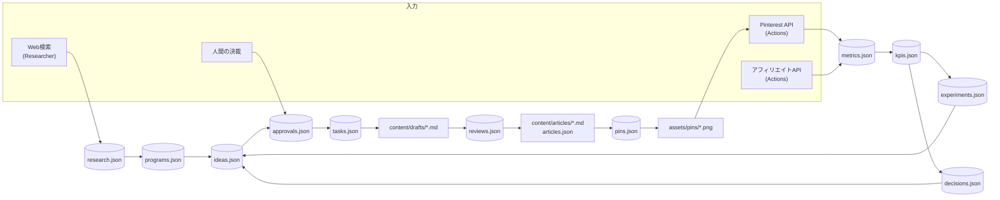

# DATA_MODEL — 会社の記憶

> **原則：会社の状態は全部 git の中の JSON にある。**
> サーバーもデータベースサービスも使いません。無料で、履歴が全部残り、iPad からも読めます。
> AI社員はこのデータだけを見て意思決定します。「口伝」はありません。

---

## 0. なぜ JSON in git なのか

| 選択肢 | 費用 | 履歴 | iPadから読む | AIから読む | 判定 |
| --- | --- | --- | --- | --- | --- |
| **git 上の JSON** | $0 | git log で全部 | GitHub / 管理画面 | ファイル読むだけ | **採用** |
| Supabase / Firebase 無料枠 | $0（枠内） | なし | 要実装 | 要APIキー | 却下（秘密情報が増える） |
| SQLite を git にコミット | $0 | バイナリ差分 | 不可 | 要ツール | 却下（差分が読めない） |
| Google Sheets | $0 | 一部 | 可 | 要APIキー | 却下（同上・APIが不安定） |

**限界も明記します：** 1ファイルが 5MB を超える、または1配列が 5,000 件を超えたら破綻します。
その時点で年次アーカイブ（`data/archive/2026/pins.json`）に分割します。

**ファイルごとの上限と処分方針**（→ DESIGN_REVIEW.md §9 の修正）

| ファイル | 上限 | 超えたら |
| --- | --- | --- |
| `runlog.json` | 200件 | 古いものから削除（**既存実装済み**） |
| `metrics.json` の `history` | 400件 | 古いものから削除（**既存実装済み**） |
| `kpis.json` | 730件（2年） | `data/archive/<年>/kpis.json` へ |
| `decisions.json` | 1,000件 | 年次アーカイブへ。ただし **`outcome` が埋まっているものは残す**（学習資産） |
| `errors.json` | — | **`handled: true` のものは90日で削除** |
| `research.json` | — | **`verdict: rejected` は理由だけ残して詳細を削る**（再調査の無駄を防ぐため理由は残す） |
| `pins.json` | 5,000件 | 年次アーカイブへ（**現在のペースなら2年以上先**） |
| `articles.json` | — | 削除しない（資産そのもの） |

**同時書き込み対策：** Routine（Plane A）と Actions（Plane B）が同時に書くと衝突します。
- Actions 側は `concurrency: { group: autopilot }` で直列化（既存の設定を維持）
- 書き込み前に必ず `git pull --rebase`（既存の `commit` action が実装済み）
- **書き込むファイルを Plane ごとに分ける**のが最大の対策 → 下の「所有者」列

---

## 1. エンティティ一覧

| # | ファイル | 中身 | 所有者（書ける者） | 状態 |
| --- | --- | --- | --- | --- |
| 1 | `data/programs.json` | アフィリエイト案件 | Researcher / 人間 | 既存 |
| 2 | `data/research.json` | リサーチの生データ | Researcher | **新規** |
| 3 | `data/ideas.json` | 記事企画 | Analyst | **新規** |
| 4 | `data/articles.json` | 記事メタ | Writer / Editor | 既存 |
| 5 | `content/drafts/*.md` | 記事の下書き | Writer | **新規** |
| 6 | `content/articles/*.md` | 公開する記事本文 | Editor | 既存 |
| 7 | `data/reviews.json` | Editor / QA の指摘 | Editor / QA | **新規** |
| 8 | `data/pins.json` | Pinterest ピン | Designer / Actions | 既存（拡張） |
| 9 | `assets/pins/*.png` | ピン画像 | Actions | 既存 |
| 10 | `data/metrics.json` | 実測値 | Actions | 既存 |
| 11 | `data/kpis.json` | 日次 KPI | Growth | **新規** |
| 12 | `data/experiments.json` | 実験 | Analyst | **新規** |
| 13 | `data/tasks.json` | 社内タスクキュー | CEO / co CLI | **新規** |
| 14 | `data/approvals.json` | 承認依頼と決裁 | CEO（依頼） / 人間（決裁） | **新規** |
| 15 | `data/decisions.json` | CEO の意思決定ログ | CEO | **新規** |
| 16 | `data/errors.json` | 失敗の記録 | co CLI / Actions | **新規** |
| 17 | `data/employees.json` | AI社員の設定と実行実績 | co CLI | **新規** |
| 18 | `data/human-tasks.json` | 人間しかできない作業 | CEO | 既存 |
| 19 | `data/state.json` | 進行状態 | CEO / co CLI | 既存（拡張） |
| 20 | `data/runlog.json` | 実行ログ | co CLI / Actions | 既存 |
| 21 | `config/config.json` | 事業設定 | 人間 | 既存 |
| 22 | `config/scoring.json` | 案件スコアリング | 人間 / CEO（承認後） | 既存（拡張） |
| 23 | `config/limits.json` | 上限・承認ゲート・自律レベル | **人間のみ** | **新規** |
| 24 | `config/kpi.json` | KPI の定義と目標値 | 人間 / CEO（承認後） | **新規** |
| 25 | `config/affiliate-links.json` | 承認済みリンク | 人間 | 既存 |

---

## 2. 新規エンティティの定義

型は TypeScript で書きます（`src/lib/types.ts` に追加、zod スキーマは `src/company/schemas.ts`）。

### 2.1 Task — 社内タスクキュー

会社の「仕事の単位」。すべての AI社員はタスクを見て動きます。

```ts
type TaskKind =
  | "research"          // 案件を調べる
  | "plan_article"      // 記事を企画する
  | "write_article"     // 記事を書く
  | "edit_article"      // 記事を検品する
  | "design_pins"       // ピン文案を作る
  | "qa_release"        // 公開前の最終検品
  | "publish_article"   // 記事を公開する（Actions が実行）
  | "publish_pins"      // ピンを投稿する（Actions が実行）
  | "post_x"            // X に告知する
  | "collect_metrics"   // 数値を取る（Actions が実行）
  | "analyze"           // 分析する
  | "fix_error";        // 失敗の後始末

type TaskStatus =
  | "blocked"    // 前提が未達（承認待ちなど）
  | "ready"      // 着手可能
  | "running"    // 実行中（クラッシュ検出のため startedAt を持つ）
  | "done"
  | "failed"
  | "parked"     // maxAttempts 超過。CEO の判断待ち
  | "cancelled";

interface Task {
  id: string;                    // "task_<base36>"
  idempotencyKey: string;        // "<kind>:<targetRef>:<yyyy-mm-dd>" 同じキーは二重に作れない
  kind: TaskKind;
  assignee: EmployeeId;          // "ceo" | "researcher" | ... | "actions"
  status: TaskStatus;
  priority: number;              // 1(高) - 5(低)
  targetRef: string | null;      // 対象の slug / id（記事なら slug、ピンなら pin id）
  input: Record<string, unknown>;// 実行に必要な最小限の入力
  output: Record<string, unknown> | null;
  requiresApprovalId: string | null; // 承認が必要な場合、approvals.json の id
  dependsOn: string[];           // 先に done になっていなければならない task id
  attempts: number;
  maxAttempts: number;           // 既定 3
  createdAt: string;
  startedAt: string | null;
  finishedAt: string | null;
  expiresAt: string;             // 既定 createdAt + 7日。過ぎたら自動 cancelled
  lastError: string | null;
  createdBy: EmployeeId;
}
```

**冪等キーが重複防止の要です。** 「同じ日に同じ記事を2回書く」は `write_article:acme-vs-zendesk:2026-09-01` が
既にあるため CLI が作成を拒否します。

**`running` のまま 2時間以上経ったタスクは、次の実行時に自動で `failed` に落とします**（セッションが落ちた場合の回収）。

---

### 2.2 Approval — 人間への承認依頼

```ts
type ApprovalKind =
  | "daily_plan"        // 今日やることの承認
  | "publish_article"
  | "publish_pins"
  | "post_x"
  | "strategy_change"   // カテゴリ追加・スコアリング変更など
  | "limit_change"      // 上限値の変更
  | "autonomy_upgrade"  // 承認ゲートを外して自動実行にする
  | "escalation";       // AIが判断できないことの相談

type ApprovalStatus = "pending" | "go" | "stop" | "expired";

interface Approval {
  id: string;                    // "apv_2026-09-01-01"
  kind: ApprovalKind;
  status: ApprovalStatus;

  // ── 人間が読む部分（すべて日本語・専門用語なし） ──
  title: string;                 // 「Acme Helpdesk の比較記事を1本つくって公開する」
  whatWillHappen: string[];      // ["比較記事 1本", "Pinterest ピン 10枚", "X 告知 2本"]
  whyThis: string;               // 選んだ理由。過去データの根拠つき
  expected: {
    programName: string | null;
    monthlyCommissionUsd: number | null;
    retentionMonths: number | null;
    ltvUsd: number | null;
    estimatedCtrPct: number | null;
    estimatedConversionPct: number | null;
    estimatedRevenueUsdMin: number | null;
    estimatedRevenueUsdMax: number | null;
    basis: string;               // 推定の根拠。「同カテゴリ既存ピン12枚の実測CTR」など
  };
  costUsd: number;               // ほぼ常に 0
  risks: string[];               // 「Cookie期間が30日と短い」など
  ifYouSayNo: string;            // 「次点の案件に切り替えます。損失はありません」

  // ── 機械が読む部分 ──
  taskIds: string[];             // GO のときに ready になるタスク
  createdAt: string;
  expiresAt: string;             // 既定 72時間。過ぎたら expired（＝実行しない）
  decidedAt: string | null;
  decidedBy: "human" | "auto" | null;
  decisionNote: string | null;   // 人間が任意で書ける一言
}
```

**設計上の要点**

- **期限切れは「実行しない」に倒します。** 承認が取れないまま勝手に実行することは絶対にありません。
- `stop` された提案は、同じ `kind + targetRef` で **7日間は再提案しません**（しつこくしない）。
- 同時に `pending` にできる承認依頼は **3件まで**。それ以上は CEO が作れません（画面が溢れないように）。

---

### 2.3 Decision — CEO の意思決定ログ

**「なぜそうしたか」を残さないと自己改善ができません。** 全ての判断をここに書きます。

```ts
interface Decision {
  id: string;
  at: string;
  by: EmployeeId;
  kind: "prioritise" | "skip" | "escalate" | "experiment" | "abandon" | "config_change";
  summary: string;               // 日本語1行
  reasoning: string;             // なぜ。参照した数値を必ず含む
  evidence: {                    // どのデータを見たか
    source: string;              // "data/kpis.json#2026-08-30"
    value: string;
  }[];
  alternatives: string[];        // 検討して選ばなかった選択肢
  relatedTaskIds: string[];
  outcome: string | null;        // 後日、結果が出たら追記する（学習用）
  outcomeAt: string | null;
}
```

`outcome` を後から埋めるのがポイントです。3ヶ月後に
**「あのとき採用した判断は当たったのか」**を CEO 自身が振り返れます。

---

### 2.4 Research — リサーチの生データ

`programs.json` に入る前の候補。足切りで落ちたものも**理由つきで残します**（再調査の無駄を防ぐため）。

```ts
interface ResearchCandidate {
  id: string;
  discoveredAt: string;
  name: string;
  homepage: string;
  affiliateProgramUrl: string;
  network: Network;
  category: string;

  pricingFromUsd: number | null;
  commissionModel: "recurring" | "one-time" | "hybrid" | "unknown";
  commissionRatePct: number | null;
  cookieDays: number | null;
  estMonthlyCommissionUsd: number | null;
  estAvgRetentionMonths: number | null;
  estLtvUsd: number | null;              // 月額 × 継続月数

  targetMarket: string[];                // ["US","UK","CA","AU"]
  mainCompetitors: string[];
  existingEnglishArticles: number | null;// 実際に検索して数えた件数
  englishCoverageQuality: "thin" | "outdated" | "moderate" | "saturated" | null;
  searchDemand: "low" | "medium" | "high" | "unknown";
  pinterestFit: number;                  // 1-10 視覚的に説明できる商材か
  approvalDifficulty: number;            // 1-10 審査の通りやすさ（1=すぐ通る）

  japaneseCompetition: number;           // 1-10
  englishCompetition: number;            // 1-10
  reliability: number;                   // 1-10

  evidence: { field: string; url: string; quote: string }[];  // ★出典必須
  unverified: string[];                  // 出典が取れなかった項目名

  score: number | null;
  verdict: "accepted" | "rejected" | "deferred";
  rejectReason: string | null;
}
```

**`evidence` を「どの項目の根拠か」まで持たせます。** 既存実装は URL の配列だけでしたが、
それだと QA が「この報酬率の根拠はどれか」を検証できません。

---

### 2.5 ContentIdea — Analyst の企画

```ts
interface ContentIdea {
  id: string;
  createdAt: string;
  status: "proposed" | "approved" | "writing" | "published" | "rejected";

  programSlug: string;
  supportingProgramSlugs: string[];
  articleType: "comparison" | "alternatives" | "best-for-pain" | "deep-review";
  workingTitle: string;
  primaryKeyword: string;
  secondaryKeywords: string[];
  searchIntent: string;
  targetWordsMin: number;                // 競合実測から決める（固定値ではない）
  targetWordsMax: number;
  competitorWordCounts: number[];        // 実際に測った上位記事の語数
  pinterestAngles: string[];             // Designer への申し送り

  // ★ここが自己改善の中核
  basedOn: {
    signal: string;                      // 「乗り換えコスト系の記事3本が平均CVR 3.1%」
    source: string;                      // "data/metrics.json"
    confidence: "low" | "medium" | "high";
    sampleSize: number;                  // 母数。小さければ confidence は low
  }[];

  expectedCtrPct: number | null;
  expectedConversionPct: number | null;
  cannibalizationCheck: {                // 既存記事との共食いチェック
    similarSlugs: string[];
    maxOverlapPct: number;
  };
}
```

---

### 2.6 Review — Editor / QA の指摘

```ts
interface Review {
  id: string;
  targetType: "article" | "pin" | "release";
  targetRef: string;
  reviewer: "editor" | "qa";
  round: number;
  at: string;
  verdict: "pass" | "fix" | "reject" | "needs_human";
  findings: {
    category: string;          // "grammar" | "overclaim" | "fact" | "seo" | "link" | ...
    severity: "blocker" | "major" | "minor";
    quote: string;             // 該当箇所の引用（必須。指摘の再現性のため）
    problem: string;
    suggestion: string;
    fixed: boolean;
  }[];
  readerImpression: string | null;  // Editor のみ:「読むのをやめたくなった段落」とその理由
  checklistResults: Record<string, "pass" | "fail" | "na">;
}
```

---

### 2.7 Pin（既存を拡張）

既存の `Pin` に、**実験のための変数**を追加します。

```ts
interface Pin {
  // ── 既存フィールドはすべて維持 ──
  id: string; articleSlug: string; templateId: string;
  title: string; description: string;
  overlayTop: string; overlayMain: string; overlayBottom: string;
  altText: string; boardName: string; imagePath: string; destinationUrl: string;
  status: PinStatus; scheduledAt: string | null; publishedAt: string | null;
  pinterestPinId: string | null; parentPinId: string | null; generation: number;
  lastError?: string; metrics?: PinMetrics;

  // ── 追加（実験と学習のため） ──
  angleType: string;          // "price-objection" | "hidden-limit" | "switching-cost" | ...
  paletteIndex: number;       // いま render 時にしか使っておらず記録されていない
  hasNumber: boolean;         // 見出しに数字が入っているか
  hasVersus: boolean;         // 比較形式か
  hasCta: boolean;
  imageHash: string;          // 画像バイトの SHA-256（重複投稿の防止）
  copyHash: string;           // overlayMain の正規化ハッシュ（重複文案の防止）
  experimentId: string | null;
  variant: string | null;     // "A" | "B"
  approvalId: string | null;  // ★これが無いと Actions は投稿しない

  // ── 追加（なおきさんが管理画面から取り消したときの記録） ──
  cancelledAt: string | null;           // 予約を取り消した時刻（未投稿のピン）
  takedownRequestedAt: string | null;   // 投稿済みのピンの削除を依頼した時刻
  takenDownAt: string | null;           // 実際に Pinterest から消えた時刻
  takedownReason: string | null;        // 取り消しの理由（なおきさんのメモ）
}
```

**`status` に `"draft"` を追加します。** Designer が作った直後は `draft`、
QA 合格 + 承認 GO で初めて `queued` → `scheduled` に進みます。

```
draft → (QA pass) → queued → (approval GO + schedule) → scheduled → published
                                                                   ↘ failed → (requeue) → scheduled
```

**`status` に `"taken_down"` を追加します。** 投稿済みだったピンを、なおきさんの
指示で Pinterest から削除した状態です。

```
scheduled ──(なおきさんが「この投稿をやめる」)──→ skipped ──(戻す)──→ scheduled
published ──(なおきさんが「Pinterestから削除する」)──→ taken_down
```

**取り消しの向きだけは、承認を要りません。** 外に出すときはゲートを通しますが、
**外から引っ込めるのはいつでも安全側**だからです。逆に、
`takedownRequestedAt` を **AI が書くことは禁止** です。AI が自分で投稿を消せると、
事故の痕跡まで消えてしまいます。書けるのは管理画面（＝なおきさん）だけです。

---

### 2.7b Article（既存を拡張）

```ts
interface Article {
  // ── 既存フィールドはすべて維持 ──
  status: ArticleStatus;   // "brief" | "drafted" | "published" | "needs_review" | "withdrawn"

  // ── 追加（なおきさんが管理画面から取り下げたときの記録） ──
  withdrawnAt: string | null;
  withdrawnReason: string | null;
}
```

**`withdrawn` を追加します。** なおきさんが管理画面から取り下げた記事です。
サイトの生成は `status === "published"` の記事だけを出すので、これでサイトから消えます。

**本文ファイル（`content/articles/*.md`）は消しません。** 押し間違いを戻せるようにするためです。
同じ画面の「やっぱり公開する」で `published` に戻ります。

---

### 2.8 Experiment — 実験

```ts
interface Experiment {
  id: string;
  createdAt: string;
  status: "running" | "concluded" | "abandoned";
  scope: "pin" | "article";
  hypothesis: string;               // 「数字入りの見出しは CTR が高い」
  variable: string;                 // ★変える変数は1つだけ
  variants: { name: string; description: string }[];
  requiredSampleSize: number;       // 各群の最低母数（既定: ピン10枚 × 300 impressions）
  metric: "ctrPct" | "conversionPct" | "revenuePerPin";
  assignments: { targetRef: string; variant: string }[];
  result: {
    variant: string;
    sampleSize: number;
    metricValue: number;
  }[] | null;
  conclusion: string | null;
  appliedTo: string | null;         // 採用した場合、どの設定に反映したか
  concludedAt: string | null;
}
```

**判定ルール（コードで強制）**

- どちらかの群が `requiredSampleSize` に達していなければ **判定しない**（`running` のまま）
- 差が **相対 30% 未満** なら「有意差なし」として `abandoned`。ノイズを学習させない
- 同時に `running` にできる実験は **2件まで**（変数が交絡しないように）

---

### 2.9 KPI — 日次スナップショット

`config/kpi.json` に定義、`data/kpis.json` に日次で追記します。

**追跡する KPI（要望の項目 + 事業に必要なもの）**

| 層 | KPI | 計算 | 目標（初期値・実測で見直す） |
| --- | --- | --- | --- |
| **入口** | Pinterest impressions | Pinterest API | — |
| | Saves | Pinterest API | — |
| | Outbound clicks | Pinterest API | — |
| | **Pin CTR** | outboundClicks / impressions | **1.5%以上** |
| **サイト** | Sessions | GA4（任意） | — |
| | 記事→アフィリエイトクリック率 | `/go/` 通過数 / セッション | **8%以上** |
| **収益** | Affiliate clicks | ネットワークAPI | — |
| | Free trials | ネットワークAPI | — |
| | Paid conversions | ネットワークAPI | — |
| | **Conversion rate** | paid / affiliate clicks | **1.0%以上** |
| | MRR (monthly recurring USD) | ネットワークAPI | — |
| | 実測 平均継続月数 | lifetimeUsd / monthlyRecurring | — |
| **効率** | Revenue per article | MRR / 公開記事数 | — |
| | Revenue per pin | MRR / 投稿ピン数 | — |
| | Cost per article | **$0**（Pro枠のみ） | — |
| | ROI | 収益 / 金銭コスト → 分母0なので**「1記事あたり所要ルーチン回数」で代替** | — |
| **分解** | SaaS ごとの収益 | 案件別 MRR | — |
| | カテゴリごとの収益 | カテゴリ別 MRR | — |
| | 記事タイプごとの CVR | 型別 | — |
| | テンプレートごとの CTR | 既存 `templateRanking()` | — |
| **運営健全性** | 承認待ち日数の中央値 | approvals | **2日以内** |
| | QA 不合格率 | reviews | **20%以下** |
| | タスク失敗率 | tasks | **10%以下** |
| | ルーチン実行回数/日 | runlog | **上限内** |
| | 承認なし公開の発生件数 | **常に 0**（1件でも出たら重大事故） | **0** |

```ts
interface KpiSnapshot {
  date: string;                    // "2026-09-01"
  traffic: { impressions: number; saves: number; outboundClicks: number; pinCtrPct: number;
             sessions: number | null; goClicks: number | null };
  revenue: { affiliateClicks: number; freeTrials: number; paidConversions: number;
             conversionPct: number; mrrUsd: number; activeSubscriptions: number;
             avgRetentionMonths: number | null };
  efficiency: { publishedArticles: number; publishedPins: number;
                revenuePerArticleUsd: number; revenuePerPinUsd: number;
                routineRunsToday: number };
  breakdown: { byProgram: Record<string, number>; byCategory: Record<string, number>;
               byArticleType: Record<string, number>; byTemplate: Record<string, number> };
  health: { pendingApprovals: number; medianApprovalWaitDays: number | null;
            qaFailRatePct: number; taskFailRatePct: number;
            unapprovedPublishCount: number };
  notes: string[];                 // Growth が書く所見
}
```

**`unapprovedPublishCount` は常に 0 であるべき値です。** 1 になったら即座に全自動処理を停止します。

---

### 2.10 Error — 失敗の記録

```ts
interface ErrorRecord {
  id: string;
  at: string;
  where: EmployeeId | "actions" | "cli";
  taskId: string | null;
  kind: "api" | "validation" | "limit" | "network" | "logic" | "external" | "unknown";
  message: string;
  detail: string | null;
  recoverable: boolean;
  handled: boolean;              // CEO が分類済みか
  handledAt: string | null;
  resolution: string | null;
}
```

**`handled: false` のエラーが 10 件を超えたら、CEO は新規タスクを作れなくなります**（掃除が先）。

---

### 2.11 config/limits.json — 安全装置の一元管理

**このファイルだけは AI が書き換えられません。** 変更には人間の承認が要ります。

```json
{
  "_readme": "このファイルは会社の安全装置です。AIは読むだけで、書き換えるには人間の承認が必要です。",

  "output": {
    "maxArticlesPerDay": 1,
    "maxPinsPerDay": 20,
    "maxPinsPerArticleTotal": 30,
    "maxPinsPublishedPerDay": 6,
    "maxXPostsPerDay": 3,
    "maxOpenTasks": 20,
    "maxPendingApprovals": 3,
    "maxUnhandledErrors": 10
  },

  "routine": {
    "maxRunsPerDay": 3,
    "minMinutesBetweenRuns": 180,
    "maxMinutesPerRun": 45
  },

  "duplication": {
    "articleHeadingOverlapMaxPct": 60,
    "requireUniquePrimaryKeyword": true,
    "requireUniquePinImageHash": true,
    "requireUniquePinCopyHash": true
  },

  "quality": {
    "requireEvidenceUrlForNumbers": true,
    "blockPublishOnBrokenLinks": true,
    "maxEditorRounds": 2,
    "minQaScore": 1.0
  },

  "gates": {
    "publishArticle":  { "requiresApproval": true },
    "publishPins":     { "requiresApproval": true },
    "postToX":         { "requiresApproval": true },
    "applyToProgram":  { "requiresApproval": true, "humanExecutes": true },
    "changeStrategy":  { "requiresApproval": true },
    "changeLimits":    { "requiresApproval": true },
    "writeDraft":      { "requiresApproval": false },
    "designPins":      { "requiresApproval": false },
    "research":        { "requiresApproval": false }
  },

  "autonomy": {
    "publishArticle": { "autoAfter": { "consecutiveApprovals": 20, "zeroQaFailures": true, "minDays": 30 } },
    "publishPins":    { "autoAfter": { "consecutiveApprovals": 50, "minDays": 30 } },
    "postToX":        { "autoAfter": null }
  },

  "approval": { "expiryHours": 72, "rejectedCooldownDays": 7 },

  "experiment": { "maxConcurrent": 2, "minSamplePerVariant": 10, "minImpressionsPerPin": 300, "minRelativeDiffPct": 30 },

  "killSwitch": { "enabled": false, "reason": "" }
}
```

**`killSwitch.enabled: true` にすると、すべてのルーチンと Actions の自動処理が即座に止まります。**
管理画面に大きな「全部止める」ボタンとして出します。

---

### 2.12 state.json の拡張

```ts
interface PipelineState {
  // ── 既存 ──
  lastResearchAt: string | null; lastArticleAt: string | null;
  lastPinPublishAt: string | null; lastAnalyticsAt: string | null;
  lastReportAt: string | null; publishedCategories: string[];
  cursor: number; milestonesHit: number[]; campaignStartedAt: string | null;

  // ── 追加 ──
  lastCeoRunAt: string | null;
  routineRunsToday: { date: string; count: number };
  phase: "bootstrap" | "growth" | "scale";   // Researcher の閾値切替に使う
  companyStartedAt: string | null;
  lastKpiSnapshotAt: string | null;
  // 自律レベル昇格（A案→B案）の判定は state に持たせません。
  // なおきさんは管理画面から GO を押すため、co を通らない決裁が普通にあります。
  // カウンタを持つと、そちらの決裁が数えられず、条件が永久に満たされません。
  // src/company/autonomy.ts が data/approvals.json の履歴から毎回計算します。
  schemaVersion: number;                     // マイグレーション用
}
```

---

## 3. データの流れ（全体図）



**閉じた輪になっているのが重要です。** 出口（metrics）が入口（ideas）に戻るので、
会社は自分の成果を見て次を決められます。

---

## 4. マイグレーション（既存データを壊さない）

- 既存 6ファイル（programs / articles / pins / metrics / human-tasks / state / runlog）は
  **フィールドを追加するだけ**で、削除・改名はしません。
- 新規フィールドはすべて optional か既定値つき。既存の JSON をそのまま読めます。
- `state.json` に `schemaVersion` を追加し、`co migrate` で段階的に埋めます。
- **現在の DRY_RUN サンプルデータ（Sample Flowdesk 等の3案件・記事2本・ピン20枚）は
  Phase 0 で削除します。** 本物のデータと混ざると学習が汚染されるためです。
  削除前に `data/archive/dry-run-2026-08.json` に退避します。

---

## 関連文書

- [ARCHITECTURE.md](ARCHITECTURE.md) / [AGENTS.md](AGENTS.md) / [SECURITY.md](SECURITY.md)
