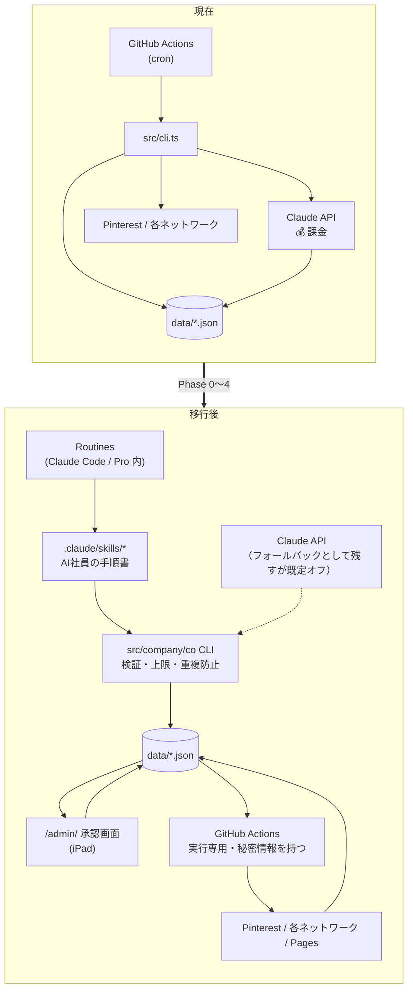

# MIGRATION — 現在のシステム → AI会社

> **原則：既存システムを壊さない。いきなり消さない。段階的に置き換える。**
> 各フェーズの終わりで「前より悪くなっていないこと」を確認してから次へ進みます。

---

## 1. 移行の全体像



**移行の本質は「Claude API を呼んでいた場所を、Claude Code のセッション自身に置き換える」ことです。**
そのために必要なのは、API の構造化出力機能の代わりになる **検証コマンド（`co` CLI）** です。

---

## 2. 既存資産の分類

### 2.1 ソースコード（`src/` 5,801行）

| ファイル | 判定 | 理由 / 変更内容 |
| --- | --- | --- |
| `src/lib/types.ts` | **維持・拡張** | 既存の型はそのまま。新エンティティを追加 |
| `src/lib/store.ts` | **維持・拡張** | 既存の読み書きはそのまま。新ストアを追加 |
| `src/lib/paths.ts` | **維持・拡張** | 新ファイルのパスを追加 |
| `src/lib/config.ts` | **維持・拡張** | `limits()` / `kpiConfig()` を追加 |
| `src/lib/util.ts` `log.ts` | **維持** | 変更なし |
| `src/lib/models.ts` | **維持（フォールバック用）** | Claude API を使うときだけ意味を持つ。既定では未使用 |
| `src/lib/claude.ts` | **維持（フォールバック用）** | `AI_BACKEND=api` のときだけ呼ばれる。既定は `session` |
| `src/stages/research.ts` | **分割** | ①zod スキーマ + 足切り + スコアリング → `co` に残す（コード） ②プロンプト → `.claude/skills/researcher/SKILL.md` へ |
| `src/stages/content.ts` | **分割** | ①品質ゲート `checkQuality()` → `co writer:check` に残す（**この関数は資産です**） ②WRITER_SYSTEM / briefPrompt / writePrompt → `writer` skill へ ③ACCURACY_REVIEWER_SYSTEM → `editor` skill へ |
| `src/stages/pins.ts` | **分割** | ①`schedule()` `dailyCapFor()` → `co` に残す（**優れた実装**） ②PIN_SYSTEM / pinPrompt → `designer` skill へ |
| `src/stages/humantasks.ts` | **分割** | ①`credentialTasks()` `writeChecklist()` → `co` に残す ②応募文の下書き → `ceo` skill へ |
| `src/stages/optimize.ts` | **維持・拡張** | `findWinners()` `templateRanking()` はそのまま。実験フレームを足す |
| `src/stages/analytics.ts` | **維持** | Actions 側で動く。Claude を使わない |
| `src/stages/publish.ts` | **維持・拡張** | **承認チェックを追加**（`approvalId` がないピンは投稿しない） |
| `src/stages/export.ts` | **維持** | Pinterest 審査待ちの逃げ道。重要 |
| `src/stages/doctor.ts` | **維持・拡張** | 「Claude API キーがない＝異常」ではなくなるので判定を書き換え |
| `src/stages/report.ts` | **維持・縮小** | REPORT.md 生成は維持。発信素材の生成は `growth` skill へ |
| `src/stages/provider.ts` | **維持（フォールバック用）** | API を使う場合のみ意味を持つ |
| `src/integrations/pinterest.ts` | **維持** | 変更なし。よく書けている |
| `src/integrations/affiliates.ts` | **維持** | 変更なし |
| `src/pins/render.ts` `templates.ts` | **維持** | **$0 で画像を作る仕組み。この設計の要。触らない** |
| `src/site/build.ts` | **維持・拡張** | **DRY_RUN 時に公開しないガードを追加**（Phase 0） |
| `src/admin/page.ts` | **維持・大幅拡張** | 承認画面（GO/STOP）を追加。**iPad 運用の中核** |
| `src/admin/pinterestConnect.ts` | **維持** | 変更なし |
| `src/orchestrator.ts` | **段階的に縮小** | `runDaily()` の判断部分は CEO skill へ。機械的な部分だけ残す |
| `src/cli.ts` | **維持・拡張** | 既存コマンドは全部残す。`co` サブコマンド群を追加 |
| `src/company/` | **新規** | `co` CLI 本体・zod スキーマ・上限チェック・重複検出 |

**削除するファイル：ゼロ。**

### 2.2 GitHub Actions ワークフロー

| ワークフロー | 判定 | 変更内容 |
| --- | --- | --- |
| `ci.yml` | **GitHub Actions に残す** | typecheck + DRY_RUN 全通し。新スキーマの検証テストを追加 |
| `autopilot-pins.yml` | **GitHub Actions に残す** | Pinterest 投稿。Secrets が要るので Actions 以外では動かせない。**承認チェックを追加** |
| `rebuild-site.yml` | **GitHub Actions に残す** | 変更なし |
| `pinterest-token-exchange.yml` | **GitHub Actions に残す** | 変更なし |
| `autopilot-daily.yml` | **分割** | ①Claude を呼ぶ部分（リサーチ・記事・ピン文案）→ **Routine へ移行** ②機械的な部分（画像描画・サイト生成・Pages公開）→ 新 `mechanical-daily.yml` として Actions に残す |
| `autopilot-weekly.yml` | **分割** | ①数値取得 → 新 `metrics-daily.yml`（毎日に格上げ）として Actions に残す ②勝ち型の分析・横展開の企画 → **Routine へ移行** |

**新設するワークフロー**

| ワークフロー | トリガー | 内容 | Claude |
| --- | --- | --- | --- |
| `mechanical-build.yml` | `push`（data/ content/ の変更時） | ピン画像描画 → サイト生成 → Pages 公開（**承認済みのものだけ**） | 使わない |
| `metrics-daily.yml` | 毎日 17:00 UTC | Pinterest + アフィリエイトの数値取得 → `metrics.json` 更新 | 使わない |
| `guard.yml` | `pull_request` / `push` | **安全装置の検証**：承認なしの公開がないか / 上限違反がないか / スキーマ違反がないか | 使わない |

`guard.yml` が重要です。**AI が書いた commit を、AI が触れないコードが検査します。**

### 2.3 「Claude API → Claude Code」に置き換えられる箇所（要望への直接回答）

| 現在の呼び出し | 置換先 | 置換可能か |
| --- | --- | --- |
| `research()` — Web検索つき調査 | Routine 内の WebSearch / WebFetch | **可能** |
| `structured(CandidateList, ...)` — 案件のJSON化 | Researcher skill が JSON を書く → `co researcher:submit` が zod 検証 | **可能** |
| `structured(Brief, ...)` — 記事の設計 | Analyst skill → `co analyst:submit` | **可能** |
| `longform(...)` — 記事本文 | Writer skill がファイルを直接書く | **可能**（むしろ自然） |
| `structured(AccuracyReview, ...)` — 誇張レビュー | Editor サブエージェント | **可能・品質は向上**（別コンテキストなので独立性が上がる） |
| `repair(...)` — 品質ゲート不合格の修正 | Writer が `co writer:check` の出力を見て直す | **可能**（ループが速い） |
| `structured(PinSet, ...)` — ピン文案 | Designer skill → `co designer:submit` | **可能** |
| `structured(ApplicationDraft, ...)` — 応募文 | CEO skill | **可能** |
| `verifyKey()` — 疎通確認 | 不要になる | — |

**置換できないものはありません。**

---

## 3. フェーズ別の移行手順

### Phase 0 — 緊急の止血（最優先・設計承認と独立に実行すべき）

**目的：いま起きている実害を止める。**

| # | 作業 | 変更規模 | 理由 |
| --- | --- | --- | --- |
| 0-1 | **DRY_RUN 時にサイト公開と commit を行わないガードを入れる** | 約10行 | サンプル記事が本番サイトに公開され続けている（→ ARCHITECTURE.md §1.6 問題1） |
| 0-2 | `autopilot-daily.yml` の schedule を一時停止（`workflow_dispatch` のみに） | 3行 | 移行中に中途半端な自動実行が走らないように |
| 0-3 | 既存の DRY_RUN サンプルデータを `data/archive/` に退避して削除 | データのみ | 本物と混ざると学習が汚染される |
| 0-4 | 失敗した6枚のピンを `skipped` にする（Trial access が原因なので再試行しても失敗する） | データのみ | 無駄なリトライを止める |

**この4つは合わせて 30分未満の作業です。GO をもらえれば設計完了報告の前でも実行します。**

---

### Phase 1 — MVP：1本の完全なループ（最小の会社）

**目的：要望どおり「1つのSaaSを発見 → 英語比較記事 → ピン → 検品 → 承認 → 投稿 → 記録」を1周させる。**

| # | 作業 |
| --- | --- |
| 1-1 | `src/company/` に `co` CLI と zod スキーマを実装（既存の zod スキーマを流用） |
| 1-2 | `config/limits.json` / `config/kpi.json` を作成 |
| 1-3 | 新データファイル 10個を空で作成 + `co migrate` で既存データにフィールド追加 |
| 1-4 | `.claude/CLAUDE.md` と 8つの `SKILL.md` を作成（既存のプロンプトを移植） |
| 1-5 | `co` に検証コマンドを実装：`researcher:submit` `analyst:submit` `writer:check` `designer:submit` `qa:check` |
| 1-6 | `/admin/` に承認画面（GO / STOP / 全部止める）を追加 |
| 1-7 | `mechanical-build.yml` `metrics-daily.yml` `guard.yml` を作成 |
| 1-8 | `publish.ts` に承認チェックを追加（`approvalId` なしは投稿しない） |
| 1-9 | **手動で1周させる**（Routine ではなく、Claude Code のセッションから手で流す） |
| 1-10 | Routine を1本だけ作成（毎朝07:00 JST）して自動で1周させる |

**Phase 1 の完了条件（これが満たされるまで次に進まない）**

- [ ] 本物の SaaS 案件が1件 `programs.json` に入っている（サンプルではない）
- [ ] 本物の英語記事が1本 `content/articles/` にある
- [ ] Editor と QA が実際に指摘を出し、`reviews.json` に記録されている
- [ ] 承認カードが `/admin/` に表示され、iPad から GO を押せる
- [ ] GO を押すと Actions が動き、記事がサイトに公開される
- [ ] **GO を押さなければ何も公開されないことを実際に確認した**
- [ ] `decisions.json` に「なぜこの案件を選んだか」が日本語で残っている
- [ ] Claude API の課金が **$0** であることを Anthropic のコンソールで確認した

---

### Phase 2 — 数を増やす（安全装置の実地テスト）

| # | 作業 |
| --- | --- |
| 2-1 | 案件を 5〜8 件まで増やす（Researcher を週1で回す） |
| 2-2 | 記事を 2日に1本のペースで積む |
| 2-3 | ピンを溜める（Pinterest が Standard access になるまでは `pins:export` で手動投稿 or 外部予約ツール） |
| 2-4 | **重複防止・上限・承認ゲートが実際に効くかを意図的にテスト**（同じ記事を2回書かせる等） |
| 2-5 | ルーチンを2本（朝・夕）に増やすかどうかを、Pro の利用枠の実測を見て判断 |

**Phase 2 の完了条件**

- [ ] 記事 10本 / ピン 100枚
- [ ] 重複生成が1件も起きていない
- [ ] 承認なし公開が **0件**
- [ ] Pro の利用枠を1週間実測し、ルーチン本数の上限が決まっている

---

### Phase 3 — 計測と自己改善

| # | 作業 |
| --- | --- |
| 3-1 | Pinterest Standard access を通す（人間タスク・審査に数日〜数週間） |
| 3-2 | アフィリエイトネットワークの API を接続（成果の自動集計） |
| 3-3 | `kpis.json` の日次記録を開始 |
| 3-4 | 最初の実験を1件だけ打つ（変数は1つ） |
| 3-5 | Growth が「何を増やせば売上が増えるか」を初めて名指しする |

**Phase 3 の完了条件**

- [ ] 300 impressions 以上のピンが 20枚以上
- [ ] 実験が1件 `concluded` している
- [ ] `kpis.json` に 30日分のスナップショットがある

---

### Phase 4 — 自律性の拡張

| # | 作業 |
| --- | --- |
| 4-1 | 承認実績が条件を満たした行為について、CEO が「自動化してよいか」の承認依頼を出す |
| 4-2 | 人間が GO を出した行為だけ、`limits.json` の `requiresApproval` を `false` にする |
| 4-3 | 承認の頻度を「毎日」から「週次のダイジェスト + 例外時のみ」に落とす |
| 4-4 | ルーチンを3本 + 週次1本に拡張（Pro の枠が足りるなら） |

---

## 4. 後方互換性の担保

### 4.1 二重実装モード（`AI_BACKEND`）

```
AI_BACKEND=session（既定）… Claude Code のセッションが判断する。API 課金 $0
AI_BACKEND=api               … 従来どおり Claude API を呼ぶ。課金あり
AI_BACKEND=fixture           … DRY_RUN。サンプルデータ。公開はしない
```

**重要な設計判断（→ DESIGN_REVIEW.md §1 の修正）：**
既存の `writeOneArticle()` を「途中で止めてセッションに制御を渡す」形にはしません。
あの関数は「設計 → 執筆 → レビュー → 品質ゲート → 保存」を一気に実行するので、
途中で止めると中間状態を保存できず、必ず壊れます。

**代わりに、既存コードには一切手を入れず、新しい経路を横に足します。**

| モード | 実行される経路 |
| --- | --- |
| `api` / `fixture` | **既存の `src/stages/*.ts` がそのまま動く**（変更なし） |
| `session` | **既存の stage 関数は呼ばれない。** skill が `co` の工程別コマンドを順に呼ぶ |

`co` は工程を細かく分けたコマンドを提供します。

```
co writer:context <ideaId>   執筆に必要な情報を全部まとめて標準出力に出す
                              → AI がそれを読んで content/drafts/<slug>.md を書く
co writer:check <slug>       既存の checkQuality() を実行し、不合格項目を列挙
                              → AI が直してもう一度 check（round は co が採番する）
co writer:submit <slug>      合格していれば articles.json に登録し、Editor のタスクを作る
```

**同じ品質ゲート関数（`checkQuality()`）を両方の経路が使うので、品質基準は完全に同一です。**
違うのは「誰が文章を書くか」だけです。

### 4.2 既存コマンドの互換性

`npm run autopilot <既存コマンド>` は**すべて動き続けます。** ただし挙動が変わるものがあります。

| コマンド | 変化 |
| --- | --- |
| `daily` | 判断部分がセッションへ委譲される。`AI_BACKEND=api` なら従来どおり |
| `article` | 同上 |
| `research` | 同上 |
| `pins` | 同上 |
| `pins:publish` | **承認チェックが追加される**（承認のないピンは skip し、理由を表示） |
| `site:build` | **DRY_RUN では public/ を作らない**（Phase 0） |
| `doctor` | Claude API キーがなくても「異常」と表示しなくなる |
| その他 | 変更なし |

### 4.3 ロールバック手順

各 Phase は独立した PR にします。問題が出たら：

```
1. config/limits.json の killSwitch.enabled を true にする（全自動処理が即停止）
2. 該当 PR を revert
3. AI_BACKEND=api に戻せば、従来の動作に完全復帰する
```

**`AI_BACKEND=api` への退避路を最後まで残すのが、この移行の保険です。**

---

## 5. 移行によって変わること・変わらないこと

| | 移行前 | 移行後 |
| --- | --- | --- |
| 記事を書くのは | Claude API（課金） | Claude Code セッション（Pro 内） |
| 記事の品質ゲート | `checkQuality()` | **同じ関数**（変わらない） |
| ピン画像 | Chromium 描画（$0） | **同じ**（変わらない） |
| ピンの予約ロジック | `schedule()` | **同じ関数**（変わらない） |
| Pinterest 投稿 | Actions | **同じ**（変わらない） |
| 数値取得 | Actions | **同じ**（変わらない） |
| データの置き場所 | git 上の JSON | **同じ**（変わらない） |
| 検品 | 同一APIコールの延長 | **別サブエージェント**（独立性が上がる） |
| 公開の可否 | AI が品質ゲートで自動判定 | **人間の GO が必須** |
| 何をやるかの決定 | cron が固定手順を実行 | **CEO が状態を見て決める** |
| 人間の作業場所 | ターミナル + GitHub | **iPad の Safari だけ** |
| 月額コスト | Claude API $6〜22 | **$0**（Pro の枠を消費） |

---

## 6. 移行しないという選択肢との比較（正直な評価）

| | 現状維持（API課金） | 移行（Routines） |
| --- | --- | --- |
| 金銭コスト | 月 $6〜22 + Pro $20 | Pro $20 のみ |
| 利用枠の圧迫 | なし | **あり**（なおきさん自身の Claude 利用と共有） |
| 記事の並列生成 | 可能（何本でも） | 難しい（1セッション1本） |
| 検品の独立性 | 中 | **高**（別コンテキスト） |
| 判断の柔軟性 | 低（cron が固定手順） | **高**（CEO が状況で変える） |
| 実装の手間 | 0 | **大きい**（Phase 1 だけで相当量） |
| 障害時の切り戻し | — | 容易（`AI_BACKEND=api`） |

**移行を勧める理由：** 金銭コストより「AI が状況を見て判断できるようになる」ことが本質だからです。
現状の cron は「毎日必ず記事を1本書く」しかできません。
**書かないほうがよい日**（承認が滞っている、品質が落ちている、案件在庫がない）を判断できません。
それが「会社」との差です。

**移行を勧めない条件：** もし「1日に記事を5本以上量産したい」なら、Pro の枠では足りません。
その場合は API を併用するか Max プランにする必要があります。ただし**この事業では量産は逆効果です**
（薄い記事の大量生産は Google にも Pinterest にも評価されません）。

---

## 関連文書

- [ARCHITECTURE.md](ARCHITECTURE.md) / [COSTS.md](COSTS.md) / [ROADMAP.md](ROADMAP.md) / [SECURITY.md](SECURITY.md)
