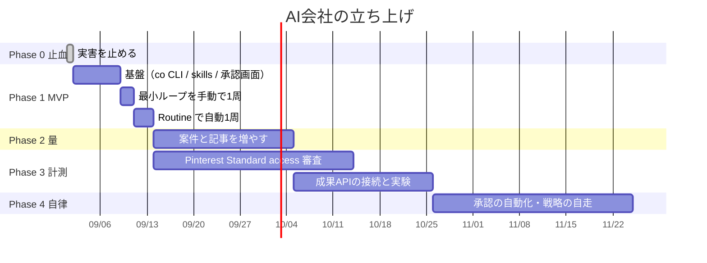

# ROADMAP — MVP から完全自律まで

> **原則：いきなり巨大なシステムを作らない。**
> 「1つのSaaSを発見して、英語比較記事を作り、Pinterest Pinを作成し、検品し、承認後に投稿し、
> 結果を記録する」という**最小の完全なループ**を先に1周させます。
> 1周したら、そのループの太さを増やしていきます。

---

## 全体像

---

## Phase 0 — 止血（所要 30分・GO をもらえれば即実行）

**いま実害が出ています。設計の承認とは独立に、先に止めるべきです。**

| # | 作業 | 実害 |
| --- | --- | --- |
| 0-1 | DRY_RUN 時にサイト公開と commit をしないガードを入れる | サンプル記事が本番サイトに公開され続けている |
| 0-2 | `autopilot-daily.yml` の cron を一時停止 | 移行中の中途半端な実行を防ぐ |
| 0-3 | DRY_RUN のサンプルデータを退避して削除 | 本物のデータと混ざると学習が汚染される |
| 0-4 | Trial access で失敗した6枚のピンを `skipped` にする | 無駄なリトライを止める |

**完了条件：** worked-for-us.com にサンプル記事が表示されていないこと。

---

## Phase 1 — MVP：最小の完全なループ（所要 約2週間）

### 目標

> **本物の SaaS 1件 → 本物の英語比較記事 1本 → ピン 10枚 → 検品 → iPad で GO → 投稿 → 結果を記録**
>
> これが1周すること。それ以上は作らない。

### やること

| # | 作業 | 成果物 |
| --- | --- | --- |
| 1-1 | `src/company/` に `co` CLI と zod スキーマ | 検証コマンド群 |
| 1-2 | `config/limits.json` / `config/kpi.json` | 安全装置 |
| 1-3 | 新データファイル 10個 + `co migrate` | データ基盤 |
| 1-4 | `.claude/CLAUDE.md` + **5つの `SKILL.md`**（ceo / researcher / writer / editor / designer） | AI社員 |
| 1-5 | `/admin/` に承認画面（GO / STOP / 全部止める / 最近の失敗 / **アフィリエイトリンク登録フォーム**） | iPad の操作面 |
| 1-6 | `mechanical-build.yml` / `metrics-daily.yml` / `guard.yml` | 実行面と安全装置 |
| 1-7 | `publish.ts` に承認チェック | 承認ゲート |
| 1-8 | **手動で1周**（Claude Code のセッションから手で流す） | 動作確認 |
| 1-9 | **Routine 作成用の貼り付け文面**を用意する（なおきさんはコピペするだけ） | 手順書 |
| 1-10 | Routine を1本作成（毎朝 07:00 JST）して自動で1周 | 自律運転の開始 |

**Phase 1 で稼働する AI社員は5人だけです**（CEO / Researcher / Writer / Editor / Designer）。
Analyst・Growth・QA は分析対象のデータが存在しないため、Phase 2〜3 で追加します（→ DESIGN_REVIEW.md §6）。

### 完了条件（チェックリスト）

- [ ] 本物の SaaS 案件が1件 `programs.json` にある（`Sample ...` ではない）
- [ ] 出典 URL つきで報酬条件が記録されている
- [ ] 本物の英語記事が1本 `content/articles/` にある
- [ ] Editor が実際に指摘を出し `reviews.json` に残っている
- [ ] QA が14項目を検査して合否を出している
- [ ] ピン10枚が10通りの切り口になっている
- [ ] `/admin/` を iPad で開いて承認カードが読める（日本語・専門用語なし）
- [ ] **GO を押さなければ何も公開されないことを実際に試して確認した**
- [ ] GO を押すと Actions が動き、サイトに公開される
- [ ] `decisions.json` に「なぜこの案件を選んだか」が日本語で残っている
- [ ] Anthropic のコンソールで **API 課金が $0** であることを確認した
- [ ] `killSwitch` を試して、実際に全部止まることを確認した

### Phase 1 で**やらないこと**（意図的に）

- 複数記事の並行生成
- 実験フレームの本格運用（枠だけ作って動かさない）
- X への告知
- 自律レベルの昇格
- ルーチンの複数本化

**「1周させる」以外のことを足すと、どこが壊れたか分からなくなります。**

---

## Phase 2 — 量を増やす（所要 約3週間）

### 目標

> **同じループを 10回まわす。安全装置が本当に効くかを実地で確かめる。**

| # | 作業 |
| --- | --- |
| 2-1 | Researcher を週1で回し、案件を 5〜8件まで増やす |
| 2-2 | 記事を2日に1本のペースで積む（合計10本） |
| 2-3 | ピンを 100枚まで積む |
| 2-4 | Pinterest Standard access が未承認なら `pins:export` で手動投稿 or 外部予約ツールへ |
| 2-5 | **安全装置を意図的に破ろうとするテスト**（下記） |
| 2-6 | Pro の利用枠を1週間実測し、ルーチン本数を決める |

### 意図的に試すこと（安全装置の実地テスト）

| テスト | 期待する結果 |
| --- | --- |
| 同じ記事を2回書かせる | 冪等キーで拒否される |
| 承認なしでピンを投稿させる | `publish.ts` が skip し、`guard.yml` が落ちる |
| 1日の上限を超えてピンを予約させる | `co` が拒否する |
| AI に `config/limits.json` を書き換えさせる | `guard.yml` が CI を落とす |
| 出典のない報酬額を記事に書かせる | QA が不合格にする |
| リンク切れの記事を公開させる | Actions が公開を中止する |

**このテストをやらずに Phase 3 に進んではいけません。**

### 完了条件

- [ ] 記事 10本 / ピン 100枚
- [ ] 重複生成 0件
- [ ] 承認なし公開 0件
- [ ] 上の6テストがすべて期待どおりに防がれた
- [ ] Pro の枠の実測データがあり、ルーチン本数が決まっている
- [ ] 人間の作業が「GO を押す」だけになっている

---

## Phase 3 — 計測と自己改善（所要 約6週間）

### 目標

> **数字が入ってくる状態を作り、最初の実験を1件だけ完了させる。**

| # | 作業 |
| --- | --- |
| 3-1 | **Pinterest Standard access の審査を通す**（人間・OAuth の画面録画の提出が必要） |
| 3-2 | **アフィリエイトプログラムに実際に応募して承認をもらう**（人間・応募文は AI が下書き済み） |
| 3-3 | 承認されたリンクを `link:set` で登録（または管理画面から）→ **ここで初めて収益が発生しうる** |
| 3-4 | アフィリエイトネットワークの API を接続 |
| 3-5 | GA4 / Search Console を接続 |
| 3-6 | `kpis.json` の日次記録を開始 |
| 3-7 | 最初の実験を1件打つ（変数は1つだけ） |
| 3-8 | Growth が「何を増やせば売上が増えるか」を初めて名指しする |
| 3-9 | **アフィリエイト API 実装の既知の弱点を直す**（→ DESIGN_REVIEW.md §13） ・Impact：ページングしていない（1,000件超で欠落） ・PartnerStack：日付フィルタを送らずクライアント側で絞っている（500件超で欠落） ・ShareASale：署名方式を実キーで未検証 ・Pinterest analytics：レスポンス形状を実データで未確認 **いずれも「収益が出始めたときに壊れる」タイプなので、成果が出る前に直す** |

### ⚠️ この時期の心構え（重要）

> **Pinterest は投稿から流入が立ち上がるまで 2〜3ヶ月かかります。**
> Phase 3 の前半は「数字がまったく動かない」のが正常です。
> ここで設定をいじると、何が効いたのか永久に分からなくなります。
>
> **判断してよいのは、300 impressions 以上を集めたピンが 20枚以上たまってからです。**

これは既存の `docs/RUNBOOK.md` に既に書かれている、正しい判断です。維持します。

### 完了条件

- [ ] Pinterest Standard access 承認済み（またはこれ以上待たない判断をした）
- [ ] アフィリエイトリンクが 3件以上登録されている
- [ ] 300 impressions 以上のピンが 20枚以上
- [ ] `kpis.json` に 30日分のスナップショットがある
- [ ] 実験が1件 `concluded` している
- [ ] Growth の提案が実際に次の企画に反映された記録が `decisions.json` にある

---

## Phase 4 — 自律性の拡張（所要 約1ヶ月〜）

### 目標

> **人間の承認頻度を「毎日」から「週次 + 例外時のみ」に落とす。**

| # | 作業 |
| --- | --- |
| 4-1 | 自律レベル昇格の条件を満たしたか CEO が確認（例：承認 20回連続 GO / QA 不合格ゼロ / 30日経過） |
| 4-2 | CEO が「記事公開を自動化してよいか」の承認依頼を出す |
| 4-3 | 人間が GO を出した項目だけ `limits.json` の `requiresApproval` を `false` に |
| 4-4 | 承認カードを「毎日の提案」から「週次ダイジェスト + 異常時のみ」に変更 |
| 4-5 | ルーチンを2〜3本に拡張（Pro の枠が足りるなら） |
| 4-6 | 案件・記事・実験の並行数を増やす |

### 自動化しない項目（永続的に人間の承認が必要）

| 項目 | 理由 |
| --- | --- |
| アフィリエイトプログラムへの応募 | 本人確認・契約行為。代理できない |
| X への投稿 | 発信元がなおきさん本人になる |
| 戦略の変更（カテゴリ追加・ニッチ変更） | 事業方針の決定 |
| 上限値・安全装置の変更 | AI が自分の枷を外せてはいけない |
| **ドル収益を円に換金するタイミング** | 完全に人間の判断（要望どおり） |

---

## Phase 5 以降 — 拡張の候補（まだ設計しない）

**MVP が回る前に設計してはいけないもの**を、忘れないようにここに置いておきます。

| 候補 | 前提条件 |
| --- | --- |
| 記事の更新・リライト（古くなった記事の刷新） | 公開記事 30本以上 |
| 複数言語展開 | 英語で収益が出てから |
| メールリスト構築 | 月間セッション 1,000 以上 |
| 自社 SaaS / 情報商材への展開 | アフィリエイト月収 $1,000 以上 |
| Introducer（高単価紹介）提案 | 既存 `growth.introducerThresholdUsd: 3000` に到達 |
| Slack / LINE への通知（MCP コネクタ） | いつでも可（優先度低） |
| SQLite への移行 | 1ファイルが 5MB / 1配列が 5,000件を超えたら |

---

## 収益の見通し（正直な試算）

**ご要望にはありませんが、「本当に利益につながる構造か」を判断するために必要なので書きます。**

| 時期 | 記事 | ピン | 想定 impressions | 想定 outbound clicks | 想定成約 | 想定 MRR |
| --- | --- | --- | --- | --- | --- | --- |
| Phase 1 完了時（2週) | 1 | 10 | ほぼ 0 | 0 | 0 | **$0** |
| Phase 2 完了時（6週) | 10 | 100 | 1,000〜5,000 | 20〜100 | 0〜1 | **$0〜40** |
| Phase 3 完了時（12週) | 25 | 250 | 10,000〜50,000 | 200〜1,000 | 2〜10 | **$80〜400** |
| 6ヶ月 | 50 | 500 | 50,000〜200,000 | 1,000〜4,000 | 10〜40 | **$400〜1,600** |

**前提：** CTR 1.5〜2%、記事→アフィリエイトクリック率 8%、成約率 1%、1成約あたり月 $40。

### この試算から言えること

1. **最初の3ヶ月は収益ゼロが基本線です。** ここで止めると何も残りません。
2. 継続報酬型なので、**収益は積み上がります**（解約されない限り毎月入り続ける）。
   50件の有効サブスクは、新規獲得を止めても月 $2,000 を生み続けます。これがこのモデルの強みです。
3. **いちばん大きなリスクは「アフィリエイトの承認が取れないこと」です。**
   記事もピンも完璧でも、リンクがなければ収益はゼロです（**現在まさにこの状態です**）。
   → だから Phase 3 の「実際に応募して承認をもらう」が、この事業の最大の関門です。
4. **AI が自律化しても、この関門は突破できません。** 人間しかできない作業です。
   AI にできるのは「応募文を完璧に下書きして、あとはコピペするだけにする」ところまでです。

---

## 各 Phase の「進んでよい / 止まるべき」判断基準

| Phase | 進んでよい | 止まって考え直すべき |
| --- | --- | --- |
| 0 → 1 | 実害が止まっている | — |
| 1 → 2 | 最小ループが1周した | 承認ゲートが効いていない／API 課金が $0 でない |
| 2 → 3 | 安全装置6テストが全部通った | 重複や承認漏れが1件でも起きた |
| 3 → 4 | 300imp 以上のピンが20枚 + 実験1件完了 | アフィリエイト承認が1件も取れない → **ニッチの見直しが必要** |
| 4 → 5 | 月 MRR $400 以上が3ヶ月継続 | 収益が伸びない → 事業モデル自体の再検討 |

**Phase 3 で「アフィリエイト承認がまったく取れない」場合は、システムの問題ではなく
ニッチ選定の問題です。その場合は `config/config.json` の `niche` を見直します。**

---

## 関連文書

- [ARCHITECTURE.md](ARCHITECTURE.md) / [MIGRATION.md](MIGRATION.md) / [COSTS.md](COSTS.md)
- [SECURITY.md](SECURITY.md) / [DATA_MODEL.md](DATA_MODEL.md) / [AGENTS.md](AGENTS.md)
- [DESIGN_REVIEW.md](DESIGN_REVIEW.md) — この設計への自己批判
